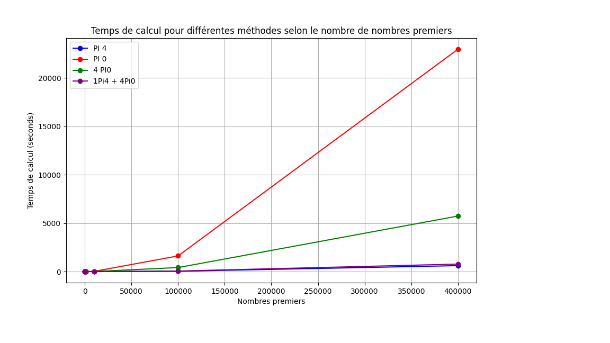

# Performance Analysis of Raspberry Pi Configurations for Prime Number Calculation

## Image:

## 1. Axes and Context
- **X-axis**: The range of prime numbers being searched (e.g., up to 10, 100, 1,000, etc.).
- **Y-axis**: The time required in seconds to perform these calculations.
- The graph compares the performance of different Raspberry Pi configurations for these calculations.

---

## 2. Observations
- **Single Pi 0 (red)**: The Raspberry Pi 0 shows extremely slow performance, with a steep curve as the range of prime numbers increases. This highlights its low capacity for intensive calculations.
- **Cluster of 4 Pi 0s (green)**: This cluster slightly improves performance compared to a single Pi 0, but the curve remains much steeper than that of the Pi 4. The benefits of parallelism are limited by the low individual performance of each Pi 0.
- **Single Pi 4 (blue)**: The Raspberry Pi 4 is by far the most efficient configuration. Its nearly flat curve indicates that it handles even the largest ranges of prime numbers effectively.
- **Pi 4 + 4 Pi 0s (purple)**: This configuration is **slower than the standalone Pi 4**. The Pi 0s provide no improvement and even introduce overhead, slowing down the overall system.

---

## 3. Detailed Performance Analysis
### The slowdown of the Pi 4 in the hybrid configuration (Pi 4 + 4 Pi 0s) can be explained by clear factors:
- **Inter-node communication**: The Pi 4 has to manage task distribution with the Pi 0s over the network. This coordination introduces additional time that outweighs the potential benefits of parallelism.
- **Performance imbalance**: The Pi 0s are significantly less powerful than the Pi 4. This creates a bottleneck, as the overall task is slowed down by the slowest units.
- **Task distribution and result collection**: After breaking the computation into subtasks, the Pi 4 must gather and combine the results from the Pi 0s. This process adds extra computation time.

### Other key points:
- **Cluster of 4 Pi 0s**: While parallelism allows tasks to be distributed among the 4 units, the improvement is minimal. Since each Pi 0 is underpowered, the cluster as a whole remains far inferior to a standalone Pi 4.
- **Single Pi 4**: This is the ideal configuration. Its processing power allows it to handle increasing ranges effectively without relying on external units.

---

## 4. Conclusion
- **Optimal configuration**: The standalone Raspberry Pi 4 offers the best performance for this task.
- **Impact of Pi 0s in a hybrid configuration**: Adding Pi 0s **slows down** the overall computation due to their low performance and the overhead of coordination.
- **Configuration in use**: The required setup is the entire cluster, which consists of the Raspberry Pi 4 and the 4 Raspberry Pi 0s.
