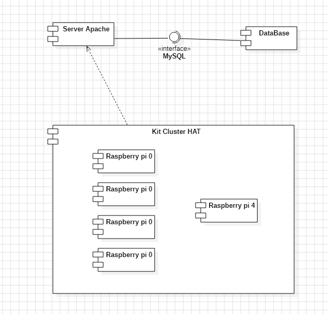

Florent VASSEUR--BERLIOUX, Tom BOGAERT, William HERUBEL, Baptiste FOURNIE, Matthieu FARANDJIS  
INF2-A

# SAÉ S5 Design Report

       

## Table of Contents

### [I – Architectural Design](#p1)
- <b>[Figure 1: Component Diagram](#fg1)</b>

### [II – Detailed Design](#p2)

       

------------------------------------------------------------------------------------------------------------------------
### I – Architectural Design
  

## Introduction
This document details the implementation and design of the project.
It explores the different aspects of the project's structure and the behaviors associated with its use.

### Architectural Design
  
<i>Figure 1: Component Diagram.</i>

#### Tools Used:

Programming Language:
- Apache Server
- MariaDB (SQL)

Hardware Architecture:
 - Raspberry Pi 0
 - Raspberry Pi 4
 - Cluster HAT Kit

 (ref: Requirements Collection; Part 4)

#### Architecture Form:

Our architecture consists of a Cluster HAT Kit, which itself is made up of four Raspberry Pi 0 units and a Raspberry Pi 4.
Our Cluster HAT Kit relies on an Apache server. The latter uses MySQL interface services to access the database.

------------------------------------------------------------------------------------------------------------------------
