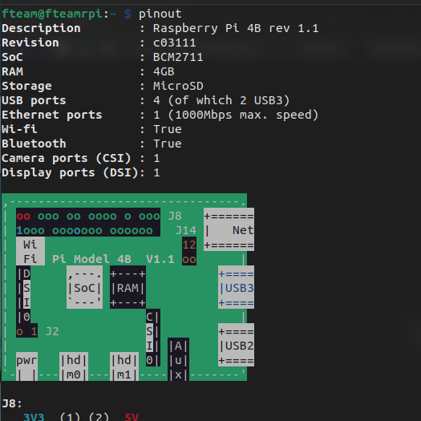

Florent VASSEUR--BERLIOUX, Tom BOGAERT, Baptiste FOURNIE, William HERUBEL, Matthieu FARANDJIS 
INF2-A

# SAÉ INF3-FI - Cluster installation

  
This document describes in detail the installation process of the RPi4 and RPi0 cluster and how it works..
 

       

---

## Plan

- ### [I – Presentation](#p1)
    - [**a) RaspberryPi 4 presentation**](#p1a)
    - [**b) RaspberryPi 0 presentation**](#p1b)
    - [**c) RaspberryPi Hat presentation**](#p1c)
    - [**d) CNAT image presentation**](#p1d)
      - Contains: explanation of the problems encountered.

- ### [II – Preparations](#p2)
  - [**a) Equipment requirements **](#p2a)
  - [**b) Software requirements**](#p2b)
  - [**c) Installation of images**](#p2c)
  - [**d) Cluster test**](#p2d)

   

---

##  I - Presentation

The RaspberryPi is a single-board microcomputer that appeared in February 2012. 
Apart from the power supply and a storage medium, it contains everything you need to make it work, such as a processor and RAM.
As with most computers, it features ports for connecting a screen, peripherals, power supply, camera or ethernet cable.
As with most computers, this one features ports for connecting a monitor, peripherals, power supply, camera or ethernet cable.

  - ###  a) RaspberryPi 4 presentation
    The RPi 4 is different from previous RPi models. 
    In processor terms, its CPU has newer cores (the Cortex-A72) and its GPU is 25% faster than previous models: 
    its maximum screen resolution is now 4K UltraHD. Its HDMI/Mini-HDMI port has been replaced by two micro HDMI ports. 
    As for RAM, which has been upgraded from LPDDR2 to LPDDR4, there are four versions of the RPi4: 1GB, 2GB, 8GB and 4GB, which is ours. 
    Two of its USB 2 ports have been replaced by two USB 3 ports, and in terms of network connectivity, the RPi4 boasts a better LAN port, Wi-Fi and Bluetooth.

    We can learn more about the features of our Raspberry Pi 4 by executing the Raspberry OS command: `pinout` 
     
    

     
    <i>result of pinout command</i>
    

     
     
    As previously mentioned, the RPi 4 features an ARM Cortex-A72 processor. Although it's a 64-bit processor, it's part of the ARMv8 family and not the x86 family often found on our PCs. 
    ARM processors are mainly used for “compact devices and tend to optimize autonomy, size, cooling and, above all, cost”, according to RedHat. This corresponds to the RPi 4's criteria: to be an affordable microcomputer. 
    It should be noted, however, that according to RedHat, x86 architecture is used more for servers, for its speed. So, outside the scope of this CAS, using RaspberryPi as a server is not the best choice. 
     
    Also note the “LP” prefix of “LPDDR4” as the RPi4's RAM type. “LP” for ‘Low Power’ is a smaller, less resource-hungry version of the simple DDR ‘Double Data Rate’. 
    DDR replaced SDRAM in the early 2000s thanks to its speed: “DDR transfers data to the processor in both the rising and falling phases of the clock signals”, according to Crucial. 
    Once again, it's a suitable component for compact devices like the RaspberryPi.
    
      
    **Sources :**
    - https://www.jmdoudoux.fr/raspberry/raspberry_pi_4_modele_B.htm
    - https://www.conrad.fr/fr/guides/materiel-educatif-kits-de-developpement/raspberry-pi.html
    - https://fr.wikipedia.org/wiki/Raspberry_Pi
    - https://www.raspberrypi.com/products/raspberry-pi-4-model-b/
    - https://fr.wikipedia.org/wiki/ARM_Cortex-A72
    - https://www.redhat.com/fr/topics/linux/ARM-vs-x86
    - https://www.hardware.fr/news/13047/quelques-details-lpddr4-ddr4-wide-i-o.html
    - https://fr.msi.com/blog/ultra-thin-business-and-productivity-laptop-with-lpddr4x-memory
    - https://www.crucial.fr/articles/about-memory/difference-among-ddr2-ddr3-ddr4-and-ddr5-memory
    - https://fr.wikipedia.org/wiki/LPDDR

  - ###  b) RaspberryPi 0 presentation

    The Raspberry Pi Zero was released in November 2015, so it came out before the RPi4 B. 
    It is a bit smaller and has fewer connectivity ports. For example, it has no Ethernet port and only 1 USB port (compared to 5 on the RPi4). It also has a mini HDMI port instead of a micro HDMI. 
    The Raspberry Pi Zero is less powerful than the RPi4: it has 512MB of RAM (compared to 4GB), and its processor has 1 core (compared to 4) and is clocked at 1GHz (compared to 1.5GHz on the RPi4). 
    Other information : 
    - GPU : VideoCore IV (compared to VideoCore VI)
    - SOC Type : Broadcom BCM2835 (compared to Broadcom BCM2711)
    - Core Type : ARM1176JZF-S (compared to Cortex-A72 (ARM v8) 64-bit)
    
      
    **Sources :**
    - https://socialcompare.com/fr/review/raspberry-pi-zero
    - https://socialcompare.com/fr/review/raspberry-pi-4
    - https://www.raspberrypi.com/products/raspberry-pi-zero/

  - ###  c) RaspberryPi Hat presentation

  - ###  d) CNAT image presentation

    RaspberryPi OS Lite est la version de RaspberryPi OS sans interface graphique. 
    Cette version permet de démarrer le RPi4 sans écran, sans clavier et sans souris. Elle pèse près de 600 Mo, c'est donc le système idéal pour notre serveur. 
    Bien que nous savons utiliser le terminal, le cas échéant, il est toujours possible d'ajouter une interface graphique à Raspberry OS Lite. 
     
    RaspberryPi OS est fondé sur le système d'exploitation gratuit Debian et est conçu spécialement pour le RaspberryPi. 
    En effet, au lancement de Raspbian, l'ancien nom de l'OS, Debian n'était pas disponible pour la famille de processeur du RaspberryPi : l'ARMv6. 
    Vu que ce système d'exploitation est dédié au RaspberryPi, il comporte des commandes dédiées au micro-ordinateur comme "raspi-config" ou encore "pinout" cité plus tôt. 
    Ubuntu étant aussi issu sur Debian, nous pouvons aussi bien s'aider de la documentation de Raspberry OS, que celle de Debian ou celle d'Ubuntu. 
    Pour notre serveur de secours, nous utiliserons Ubuntu Server. L'installation du serveur LAMP et de LogMeIn Hamachi reste pratiquement la même. 

      
    **Sources :**
    - https://www.raspberrypi.com/documentation/
    - https://raspberrytips.fr/raspberry-pi-os-versions/
    - https://alain-michel.canoprof.fr/eleve/tutoriels/raspberry/premiers-pas-raspberrypi/activities/utiliser-raspi-config.html
    - https://www.macg.co/ailleurs/2023/10/les-raspberry-pi-passent-bookworm-pour-le-nouvel-os-139771

   

---

##  II - Préparatif

  - ###  a) Matériels nécessaires
    Pour utiliser le RPi4 sur le même écran de son ordinateur tout en l'utilisant, on peut utiliser un boîtier d'acquisition. 
    C'est un adaptateur HDMI vers USB, permettant de récupérer le signal vidéo sur son ordinateur. Utile pour enregistrer l'écran du RPi4 par exemple. 

     
    Pour procéder à l'installation du système, il faut au préalable avoir :  

    - **Un RaspberryPi et son alimentation** 
      Monsieur Hoguin nous a confié un RaspberryPi 4 modèle B. C'est un micro-ordinateur à manipuler avec précaution. En effet, il n'est pas dans un boîtier. 
      Son alimentation se branche au RPi4 via son port USB type C.  
    
    - **Une carte microSD** 
      Monsieur Hoguin nous a donné une carte micro SD Verbatim de 16Go. 
      Le RPi4 est réputé comme étant un tueur de carte micro SD. Nous devons donc archiver régulièrement l'intégralité du contenu de cette carte.  
    
    - **Un câble HDMI et son adaptateur vers micro HDMI** 
      Le RPi4 se branche en micro HDMI. Ayant un câble HDMI, un adaptateur était nécessaire. Il nous a coûté 3€ à la FNAC.  
  
    - **Un clavier d'ordinateur** 
      Un clavier d'ordinateur basique se branchant en USB suffit.  
    
    - **Un câble ethernet** (préférable) 
      Brancher un câble ethernet permet de vérifier grâce aux leds que le RPi4 soit bien connecté au réseau. 
      On peut aussi connecter le RPi4 en Wi-Fi. Mais grâce au câble nous sommes assurés de ne pas accuser la connexion si on rencontre des problèmes dans la plupart des cas.

 

  - ###  b) Logiciels nécessaires

    Pour installer un système sur un support dédié au RaspberryPi, le plus simple est d'utiliser le logiciel "Pi Imager". 

     
    En-dehors du logiciel Pi Imager, vu que nous possédons un boîtier d'acquisition, nous allons utiliser les logiciels VLC et Mirillis Action!. 
    VLC permettra d'afficher sur son ordinateur la sortie vidéo du boîtier provenant du RPi4, et Action! permettra en même temps d'enregistrer celui-ci et même le bureau Windows. 
    Grâce aux vidéos, nous pouvons décrire précisément l'installation du système et la résolution des problèmes rencontrés. 
    Des captures d'écran de ces vidéos illustrent ce document. 

      

    

        
       <i>VLC affichant l'écran du RPi4 sur Windows 10</i>
    

- ###  c) Installation de Raspberry OS Lite

    À partir du bouton "Choisir l'OS", Pi Imager propose différents systèmes pouvant être installé. On peut aussi installer son propre système. 
    Nous avons choisi Raspberry OS Lite pour les raisons évoqué lors de la présentation de ce système.

      

    

         
        <i>Menu de Pi Imager</i>
    

  
     

    Une fois avoir sélectionné le système, un petit bouton engrenage apparaît pour paramétrer l'installation de RaspberryPi OS Lite. 
    On peut y donner un nom à l'ordinateur, activer SSH, modifier le login et le mot de passe de l'utilisateur par défaut, configurer le Wi-Fi, le clavier ou encore le fuseau horaire. 
    Nous avons configuré l'installation par rapport à notre besoin. Il est tout à fait possible de le faire plus tard avec la commande `raspi-config`. 
     
    Les trois cases à cocher tout en bas ne sont pas très importante. 
    La télémétrie correspond à l'envoi de pings à raspberry.org pour des fins de statiques, c'est inutile, ça ne restreint pas l'utilisation du système, nous l'avons donc désactivé pour ne pas être surveillés. 
      

    

         
        <i>Options d'installation de Pi Imager</i>
    

     

    Une fois fait, il suffit de sélectionner le bon lecteur et de flasher la carte microSD. C'est assez rapide, et la carte microSD est immédiatement opérationnel.

      
    **Source :**
    - https://framboise-pi.skyost.eu/article/maitriser-raspberry-pi-imager/

   

---
