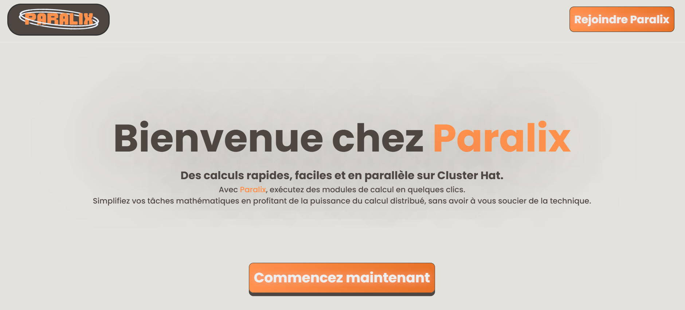
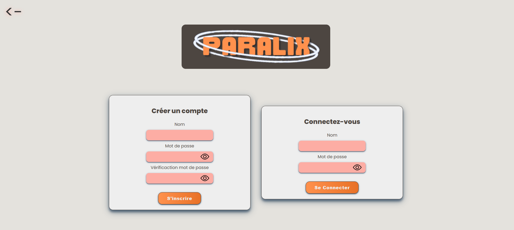
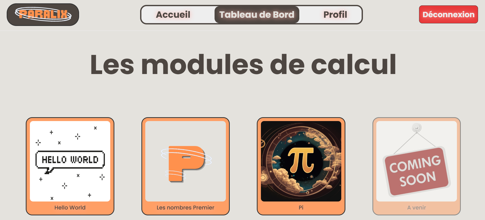
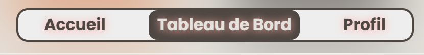
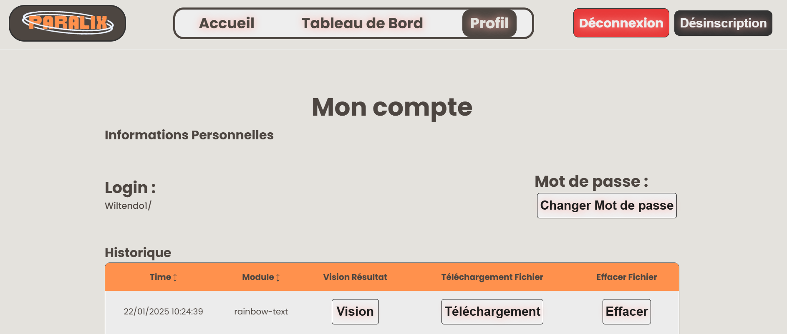
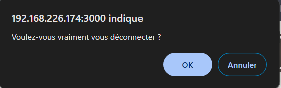
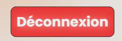
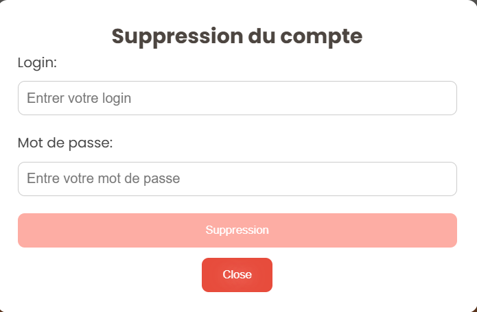

# Matthieu FARANDJIS, Tom BOGAERT, Florent VASSEUR--BERLIOUX, William HERUBEL, Baptiste FOURNIÉ, Lucas DA SILVA FERREIRA  
INF3-FI  

# 
 Table of Contents 

- ### [I - User Manual for the "Paralix" Website](#p1)
  - [**Introduction**](#p1a)
  - [**Technical Requirements**](#p1b)
  - [**Support and Assistance**](#p1c)

- ### [II - Visitor](#p2)

- ### [III - Logged-in User](#p3)
  - [**Dashboard**](#p3a)
  - [**Profile**](#p3b)
  - [**Additional Actions**](#p3c)

- ### [IV - Administrator](#p4)
  - [**Dashboard**](#p4a)
  - [**Profile**](#p4b)

 

---

  

#  I - User Manual for the "Paralix" Website

##  A. Introduction
Welcome to Paralix, your platform dedicated to mathematical module execution. This manual is designed to guide you through using our website to simplify your complex calculations and optimize your mathematical work.

##  B. Technical Requirements

To fully utilize the features of the website, certain technical requirements must be met. Please ensure you have the following before getting started.

### B.1. Internet Connection
- **Connection Type**: A stable Internet connection is required to navigate the website.
- **Recommended Speed**: At least 1 Mbps for quick page loading. A faster connection is recommended for multimedia content (videos or large images).

### B.2. Compatible Web Browser
- **Recommended Browsers**:
  - Google Chrome (version 90 or higher)
  - Mozilla Firefox (version 85 or higher)
  - Microsoft Edge (version 88 or higher)
  - Safari (version 14 or higher for Apple users)
- **Updates**: Ensure your browser is updated to avoid display or compatibility issues.

### B.3. Compatible Device
The site is designed to work across various devices. Check the minimum specifications to ensure an optimal experience:
- **Computer**: 
  - Operating System: Windows 10, macOS 10.14 or later
  - Minimum Screen Resolution: 1366 x 768 pixels
- **Mobile/Tablet**: 
  - Supported Systems: Android 8.0 or iOS 13 or later
  - Minimum Resolution: 720 x 1280 pixels

### B.4. Required Software Configuration
- **JavaScript Enabled**: The website requires JavaScript for certain interactive features. Ensure this option is enabled in your browser.
- **Cookies**: Cookies must be enabled to save your preferences and allow personalized browsing.

### B.5. User Account (if applicable)
Certain content or features may require authentication:
- **Registration**:
  - Provide a login to recognize yourself.
  - Create a password that meets security rules (minimum 8 characters, including letters, numbers, and symbols).
- **Login**:
  - Required credentials: Login and password.

### B.6. Secure Environment
To ensure safe browsing:
- Use up-to-date antivirus software.
- Access the site via a secure connection (*https://*).
- Avoid browsing on unsecured public networks (e.g., public Wi-Fi) to protect your personal data.

##  C. Support and Assistance
For further assistance, please check our help section below, where you will find answers to frequently asked questions.

  

---

#  II - Visitor

## Once on the Platform

The visitor has access to a video presentation and usage guide of the site. This video explains the main features and navigation of the platform.

---

## Authentication

By clicking on **"Authentication"**, the visitor can create a user account or log in to access the modules available on the site.

---

### Two options are available to the user:

1. **Create an Account (new user or new account)**  
   If the visitor is a new user or wants to create a new account, they can click on **"Sign Up"**.

   They will need to provide the following information:  
   - **A login**: A unique identifier for recognition.  
   - **A password**: To be entered twice for confirmation.

   .png)

2. **Log In (existing user not logged in)**  
   If the visitor already has an account, they can click on **"Log In"**.

   The required information is:  
   - **Login**: The identifier used when creating the account.  
   - **Password**: Associated with the login.

   .png)

#  III - Logged-in User

Once logged in with your account, you will have the option to execute various modules.

---

##  A. Module

Clicking on one of the modules will open a form.

To use the module, you will need to fill in the various fields required (these fields vary depending on the selected module).

### Available Forms:
- **Hello World**:
  - The requested phrase.  
  - Desired number of Rpi (limited to the available options).

- **Prime**:
  - End number.  
  - Desired number of Rpi (limited to the available options).

- **Pi**:
  - Number of Points.  
  - Desired number of Rpi (limited to the available options).

---

After filling out the form, simply click the corresponding button to launch the module.

.png)

---

### Request Loading

While the request is loading, it is recommended to wait.  
If, at any time, you wish to stop the execution, you can do so by clicking the designated button.

.png)

---

### Viewing Results

Once execution is complete, you will be able to view the results. Here is an example of how the results are presented:

.png)

---

### Available Options

In the module form area, an options section is also available.  
This section offers two checkboxes:  
- **Save Results**: Allows you to save your results in a history for later viewing.  
- **Automatic Space Management**: Automatically deletes the least frequent results to make room for new ones. Each user has limited space, so it may be necessary to manage available space.

.png)

---

### Notifications

When displaying a result, a notification will inform you:  
- About the success of the save.  
- About the files that have been deleted (if applicable).

.png)

##  B. Profile

At the top of the page, you will find a navigation bar that allows you to access different sections of the site such as **"Home"**, **"Dashboard"**, and **"Profile"**.

- The **first button** takes you back to the **"Home"** page, the page you saw upon arrival.  
- The **second button** takes you to the **"Dashboard"** page, where you are currently.  
- The **third button** takes you to the **"Profile"** page.

---

### Actions available on the Profile page

1. **View Your Personal Information**  
   - This information is visible in the **Personal Information** box.

   .png)

2. **Change Your Password**  
   - Click the **"Change Password"** button to open a form.  
   - This form will ask for:  
     - Your current password.  
     - Your new password.  
     - The new password (entered a second time for confirmation).

   .png)

.png)

3. **View History**  
   - In this section, you can check the following details:  
     - **Execution time** of the task.  
     - **Module used**.  
     - **Possible actions on the results**:
       - **View results**:
         - Click the button to open a form detailing the attributes and data obtained.
         - Example form:  
           .png)
       - **Download results**:
         - Click the button to download the results.  
         - Example after clicking:  
           .png)
       - **Delete results**:
         - Click the button to delete the results.  
         - Example after confirmation:  
           .png)

##  C. Additional Actions

Three buttons are available during the use of the pages:

---

### 1. **Logout**  
- Allows you to log out of your user account.  
- A confirmation will be requested to validate your request:  
    
- Once confirmed, you will be redirected to the **Home** page:  
  

---

### 2. **Unsubscribe**  
- Allows you to delete your account from the site.  
- When activated, a form will appear asking for:  
  - **Login** of the connected user.  
  - **Password** associated with the login.  
    
- After confirmation, the user will be removed from the database:  
  

---

### 3. **Paralix**  
- Allows you to return directly to the **Home** page.  
  

#  IV - Administrator

The Administrator can perform the same actions as a logged-in user, except on the Profile page where additional actions are available.

### **Profile**

In addition to viewing their information, changing their password, and viewing history, two new sections have been added: 
- "Process Control":
  - Allows viewing current calculations.
  - Cancelling calculations.
  - Refreshing the list (to display other calculations not present).
  - .png)

- "Statistics":
  - Allows viewing the number of uses for each module:
    - .png)
  - Viewing the number of uses for each module per user:
    - .png)
  - Viewing the general history of all users:
    - .png)

   

----------------------------------
We hope this manual helps you effectively use Paralix to solve your mathematical problems. If you have any questions or comments, don't hesitate to contact us. Thank you for choosing Paralix for your needs!
