# Rapport : Implémentation et Analyses de la Performance et de la Scalabilité de Monte Carlo pour π

## Introduction

Ce rapport présente les travaux réalisés dans le cadre de notre SAE, combinant analyses théoriques et implémentations pratiques. Il s'appuie sur des notes personnelles et a été partiellement rédigé avec l'aide de ChatGPT pour structurer et formuler certaines sections.

Les travaux explorent plusieurs aspects de la programmation parallèle et distribuée. La méthode de Monte Carlo est utilisée pour estimer la valeur de π, avec une analyse détaillée des algorithmes et des techniques de parallélisation mises en œuvre. L'implémentation est effectuée sur une machine à mémoire distribuée au sein du cluster HAT, composé d'un Raspberry Pi Zero et de quatre Raspberry Pi 4.

Ce projet s'inscrit également dans une démarche visant à vérifier la conformité aux normes ISO pertinentes en matière de calcul distribué et de bonnes pratiques de programmation, tout en développant des compétences applicables aux environnements professionnels.


## I. Monte Carlo pour calculer π

Soit l'aire `A_quartD` d'un quart de disque de rayon 1 :

```
A_quartD = (π * r^2) / 4
```

Pour un carré de côté `r = 1`, l'aire `A_c` est :

```
A_c = r^2 = 1
```

On considère des points `X_p(x_p, y_p)` dont les coordonnées sont tirées uniformément dans l'intervalle `]0,1[`.

La probabilité que `X_p` appartienne au quart de disque est :

```
P = A_quartD / A_c = π / 4
```

En effectuant `n_tot` tirages aléatoires, soit `n_cible` le nombre de points situés dans le quart de disque. Si `n_tot` est grand, on peut estimer `P` par :

```
P ≈ n_cible / n_tot ≈ π / 4
```

D'où :

```
π ≈ 4 * n_cible / n_tot
```
### Image : Schéma de MonteCarlo 
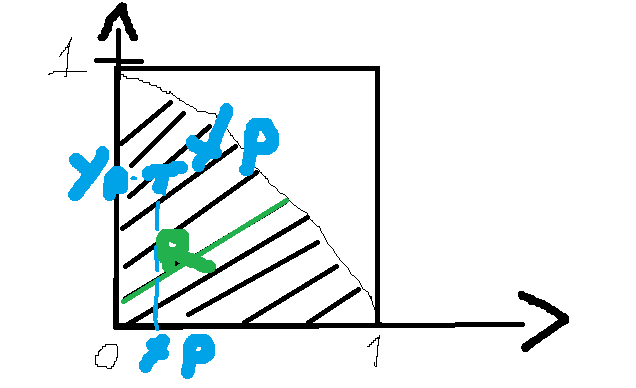

## II. Algorithme et parallélisation.

```python
ncible = 0
for (p = 0| n_tot > 0| n_tot--) {
    xp = rand()  # Loi U(]0,1[)
    yp = rand()
    if ((xp**2 + yp**2) < 1) {
        ncible += 1
    }
}
π = 4 * ncible / n_tot
```

### Tâches

1. **T0 : Tirer et compter `n_tot` points**
    - **T0p : Tirer un point**
        1. **T0p1 : Tirer `X_p` et `Y_P`**
        2. **T0p2 : Incrémenter `n_cible`**

2. **T1 : Calculer `π`**

### Dépendances entre tâches :
- `T1` dépend de `T0`
- `T0p2` dépend de `T0p1`
- Les instances de `T0p1` sont indépendantes entre elles.
- Les instances de `T0p2` sont indépendantes entre elles.

### Ressource critique et section critique :
- **`n_cible`** est une ressource critique.
- **Section critique** : `ncible += 1`.
### Conclusion 
Nous pouvons en conclure que les instances de TOp1 peuvent être entièrement parallélisées, car elles sont indépendantes les unes des autres et ne constituent pas une ressource critique.


###  Paradigme Master Worker

#### Explication du paradigme Master Worker

Dans le paradigme Master/Worker, le travail est réparti en plusieurs tâches distinctes, chacune étant assignée à un processus ou un thread appelé "Worker". Chaque Worker traite de manière autonome une portion du travail de manière itérative, et à la fin de son exécution, les résultats obtenus sont collectés et combinés par un processus central, le "Master". Ce dernier a la responsabilité de coordonner l'ensemble du processus, de gérer l'attribution des tâches aux Workers, ainsi que de rassembler et d'interpréter les résultats pour produire la sortie finale. Ce modèle permet de paralléliser les calculs, optimisant ainsi les performances dans les systèmes distribués ou multi-threadés.

####  Image : Schéma de MasterWorker
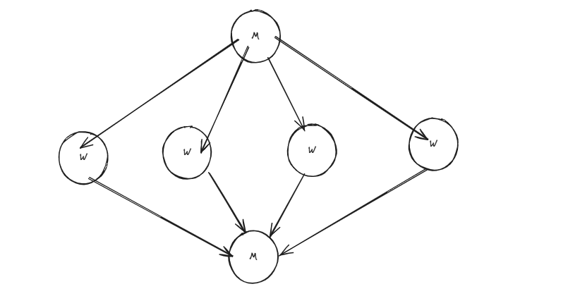
#### Pseudo code Master Worker MonteCarlo

    ENTRÉES :
    n_tot : nombre total de points
    n_workers : nombre de workers
    
    FONCTION TirerPoint()
    xp ← valeur aléatoire entre 0 et 1
    yp ← valeur aléatoire entre 0 et 1
    RETOURNER (xp^2 + yp^2 < 1)
    FIN FONCTION
    
    FONCTION MonteCarloPartial(n_charge)
    ncible_partial ← 0
    POUR i DE 1 À n_pcharge FAIRE
    SI TirerPoint() ALORS
    ncible_partial ← ncible_partial + 1
    FIN SI
    FIN POUR
    RETOURNER ncible_partial
    FIN FONCTION
    
    PROCÉDURE PRINCIPALE
    n_charge ← n_tot / n_workers
    Liste ncibles ← Liste vide
    
        POUR chaque worker DE 1 À n_workers
            ncible_partial ← MonteCarloPartial(n_charge)
            AJOUTER ncible_partial à ncibles
        FIN POUR
    
        ncible_total ← Somme des valeurs dans ncibles
        π ← 4 * ncible_total / n_tot
        AFFICHER "Estimation de π : ", π
    FIN PROCÉDURE

#### Explications en pseudo-code :

Chaque worker effectue une partie des calculs (calcul de ncible_partial).

Workers :
Chaque worker travaille de manière indépendante, calculant son propre ncible_partial pour un sous-ensemble des points(n_charge).

Collecte des résultats :

Le master collecte les résultats de chaque worker et effectue une somme des ncible_partial.

Estimation de π :

Le master calcule π en utilisant la formule π ≈ 4 * ncible_total / n_tot.

## 3.Mise en oeuvre sur Machine à mémoire distribué

Après avoir expliqué le pseudo-code du méthode de Monte Carlo et son principe de parallélisation, l'étape suivante consiste à la mettre en œuvre sur notre cluster distribué, composé de plusieurs Raspberry Pi. Ce cluster se compose de deux types de machines: d'un Raspberry Pi 4 (plus puissant) et de 4 Raspberry Pi 0 (moins puissants).

### **Architecture du paradigme Master Worker en utilisant MPI**
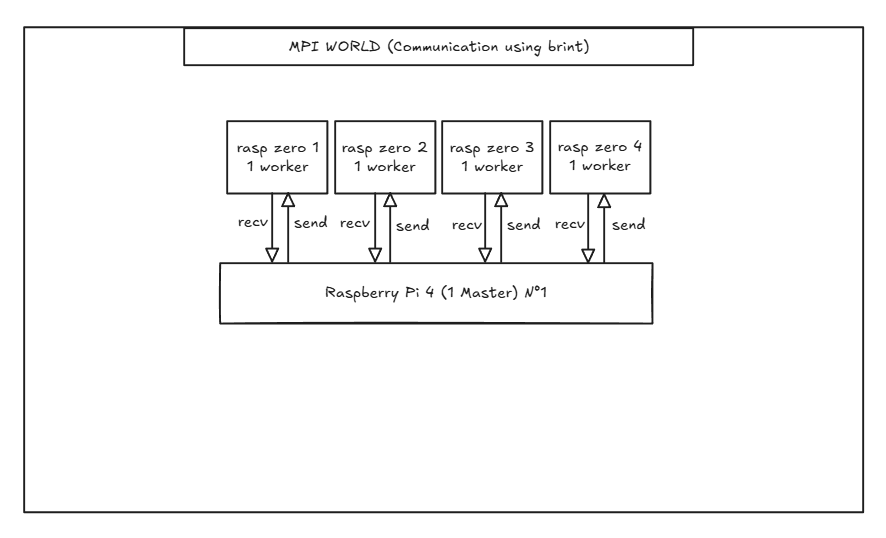
Ce schéma représente une architecture **Master-Worker** utilisant **MPI (Message Passing Interface)** pour la communication entre un Raspberry Pi 4 (le *master*) et quatre Raspberry Pi Zero (les *workers*). L'objectif est de répartir des tâches de calcul ou de traitement entre plusieurs unités de calcul pour optimiser les performances.

#### **Architecture :**
1. **Master :**
   - Le Raspberry Pi 4 agit comme un **coordinateur principal** (master).
   - Il gère la distribution des tâches aux *workers* et collecte leurs résultats.

2. **Workers :**
   - Chaque Raspberry Pi Zero joue le rôle d’un **worker**.
   - Ils sont chargés de recevoir des tâches, de les exécuter, puis de renvoyer les résultats au *master*.

3. **Réseau MPI :**
   - Tous les Raspberry Pi sont connectés via un réseau local (par exemple, Wi-Fi ou Ethernet).
   - La communication est orchestrée par **MPI.COMM.WORLD**, qui attribue un identifiant unique (**rank**) à chaque processus dans le réseau.

#### **Communication entre les Raspberry Pi :**
1. **Échange de données :**
   - Le *master* utilise des fonctions MPI pour **envoyer des tâches** aux *workers* (`send`) et pour **recevoir les résultats** (`recv`).
   - Les *workers* reçoivent les données (`recv`), effectuent les calculs, puis envoient les résultats au *master* (`send`).

2. **Processus synchronisé :**
   - Le *master* peut envoyer des tâches spécifiques à chaque *worker* en utilisant leurs identifiants uniques (**ranks**).
   - Par exemple, le *master* (rank 0) envoie des instructions aux *workers* (ranks 1 à 4) et attend les réponses.

### **Exemple d’exécution :**
1. Le *master* envoie des tâches spécifiques à chaque *worker* (par exemple, un calcul mathématique ou un traitement de données).
2. Chaque *worker* exécute sa tâche indépendamment.
3. Une fois le travail terminé, les *workers* renvoient les résultats au *master*.
4. Le *master* collecte les résultats, les combine, ou les utilise pour d'autres opérations.

Cette architecture permet de **répartir les calculs** entre plusieurs appareils.


###  Précision de  Architecture matérielle choisie 

#### Raspeberry PI 4 B
- **Processeur** : 1,5 GHz quadricœur ARM Cortex-A72
   - Cœurs physiques : 4 cœurs
   - Threads : 4 threads (1 par cœur)
   - Fréquence de base : 1,5 GHz
   - Architecture : 64 bits 

- **Mémoire RAM** : 8 Go
#### Raspeberry PI 0  

**Processeur** : 1 GHz monocœur ARM Cortex-A53
- Cœurs physiques : 1 cœur

- Threads : 1 thread

- Fréquence de base : 1 GHz

- Architecture : 32 bits (ARMv6)

**Mémoire RAM** : 512 Mo

Cette architecture du clusterhat sera utilisé pour lancer les tests

###  Analyse de  MCscala.pi
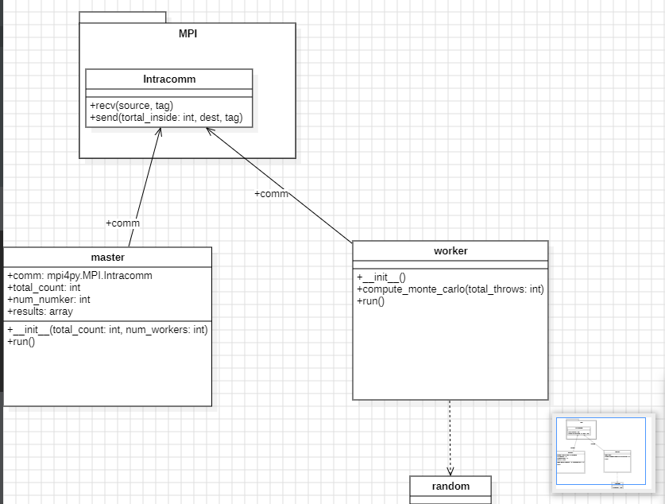


#### **1. Composants principaux**

1. **MPI** :
   - Contient une classe `Intracomm` avec des méthodes :
     - `recv(source, tag)` : pour recevoir des messages d'un autre processus.
     - `send(total_inside: int, dest, tag)` : pour envoyer des messages à un autre processus.

2. **Master** :
   - Attributs :
     - `comm: mpi4py.MPI.Intracomm` : l'instance de communicateur pour les communications MPI.
     - `total_count: int` : le nombre total de lancers pour les calculs de Monte Carlo.
     - `num_workers: int` : le nombre de travailleurs dans le groupe MPI.
     - `results: array` : un tableau pour stocker les résultats des travailleurs.
   - Méthodes :
     - `__init__(total_count: int, num_workers: int)` : le constructeur pour initialiser les attributs.
     - `run()` : méthode pour envoyer des tâches aux travailleurs, collecter les résultats et calculer la valeur de Pi.

3. **Worker** :
   - Méthodes :
     - `__init__()` : constructeur pour initialiser l'instance de communicateur.
     - `compute_monte_carlo(total_throws: int)` : méthode pour effectuer les calculs de Monte Carlo et compter les points à l'intérieur du cercle.
     - `run()` : méthode pour recevoir les tâches du maître, effectuer les calculs et renvoyer les résultats au maître.

4. **Random** :
   - Méthodes :
     - `random(): float` : génère un nombre aléatoire entre 0 et 1.

#### **2. Interactions entre les classes**

- **Communication MPI** :
  - La classe `Master` utilise `MPI.COMM_WORLD`, une instance de `mpi4py.MPI.Intracomm`, pour envoyer le nombre total de lancers (`total_count`) aux travailleurs et pour recevoir les résultats des calculs.
  - La classe `Worker` utilise également `MPI.COMM_WORLD` pour recevoir le nombre total de lancers du maître et pour renvoyer les résultats des calculs.

- **Calcul de Monte Carlo** :
  - La méthode `compute_monte_carlo` de la classe `Worker` utilise la fonction `random()` pour générer des coordonnées aléatoires et compter les points à l'intérieur du cercle.

- **Coordination et Calcul Final** :
  - La classe `Master` coordonne les tâches en envoyant le nombre total de lancers aux travailleurs et en recevant les résultats. Elle calcule ensuite la valeur de Pi en utilisant les résultats agrégés.
  

#### **3. Correspondance avec le pseudo-code de Monte Carlo**

- **Master** : La classe `Master` divise `total_count` en sous-tâches égales entre les `Workers`. Chaque `Worker` exécute la fonction `compute_monte_carlo(total_throws)` et renvoie un résultat. Le `Master` utilise `recv` pour récupérer les résultats et agrège le tout pour calculer la valeur finale de π.

- **Workers** : Chaque `Worker` effectue une partie du calcul en comptant les points dans le cercle. Leur méthode `run()` reçoit les lancers du `Master`, effectue les calculs et renvoie les résultats.

- **Communication MPI** : La classe `Master` envoie le nombre total de lancers aux `Workers` et reçoit les résultats via `MPI.COMM_WORLD`.


##  4.Analyse des performances MCscala.pi

Nous comparerons l’efficacité des l'implémentation de MCscala.pi en analysant deux aspects :

**Scalabilité forte** : Elle évalue les performances lorsque le nombre de threads augmente, mais que le nombre total de points reste fixe. Cet aspect permet de voir si chaque implémentation utilise efficacement les ressources multiprocesseurs disponibles.

**Scalabilité faible** : Elle mesure la capacité d’un programme à maintenir des performances constantes lorsque le nombre total de points augmente proportionnellement au nombre de threads. Cela reflète l’efficacité de la gestion des charges de travail croissantes.

Pour les tests, nous choisirons un total de points de 10^4, 10^5, 10^6,10*7 * 5 . Cette sélection permet d’analyser l’impact de la charge de travail sur les performances tout en garantissant une granularité suffisante pour observer les différences. Les valeurs inférieures (10 à 10^3) ne seront pas analysées, car les temps d’exécution sont presque équivalents et peu significatifs. De plus, multiplier par 16 permet de tester la scalabilité avec différents nombres de threads : 1, 2, 4.

Pour le calcul de la scalabilité, nous représentons en abscisse (axe horizontal) le nombre de processeurs/threads utilisés et en ordonnée (axe vertical) le **speedup**.

Le **speedup** mesure l'accélération obtenue grâce à la parallélisation. Il se calcule à l'aide de la formule suivante :

**Speedup = T1 / Tp**,

où :
- **T1** est le temps d'exécution en mode séquentiel (1 thread),
- **Tp** est le temps d'exécution avec *p* threads.

Un speedup idéal (linéaire) en **scalabilité forte** se traduit par une courbe où la valeur double lorsque le nombre de threads double, pour une taille de problème fixe. Cela reflète une parfaite répartition du travail entre les threads.

En **scalabilité faible**, le speedup est observé en augmentant à la fois la taille du problème et le nombre de threads de manière proportionnelle. Ici, un speedup linéaire indique que le système maintient une efficacité constante malgré l'augmentation de la charge.

### Automatisation des tests et leurs traitements

Il ya des scripts  permettant d'automatiser les tests pour évaluer les performances de **scalabilité forte** et **scalabilité faible**.

- **Script `script_scalabilite_forte.bat`** :  
  Ce script divise le nombre total de points (**$TOTAL_POINTS**) de manière fixe et fait varier le nombre de threads (**$THREAD_COUNTS**). Il exécute chaque configuration plusieurs fois (**$REPEAT_COUNT**) pour garantir des mesures fiables. Les résultats sont enregistrés dans des fichiers CSV distincts pour le programme  MCscala.pi.

- **Script `script_scalabilite_faible.bat`** :  
  Ici, le script augmente proportionnellement le nombre total de points avec le nombre de threads. Chaque **thread** traite une charge de travail fixe (**$pointsParTravailleur**), simulant une augmentation uniforme de la taille du problème. Les fichiers CSV collectent les résultats pour analyser l'efficacité parallèle.

Pour le traitement on utilise la classe PiAverageToCsv qui  permet de calculer la moyenne des résultats pour chaque configuration de test, en regroupant les 20 répétitions effectuées. Cela facilite l'analyse en lissant les données pour chaque expérience.

Avec les résultats obtenus sous forme de fichiers CSV, j'utilise un code Python pour calculer le speed-up et tracer les graphes correspondants. Ce script extrait les données, calcule le speed-up en comparant le temps d'exécution avec un seul processeur à celui avec plusieurs processeurs, et génère un graphique montrant la scalabilité forte et faible, avec une courbe pour chaque valeur unique de Ntot. Les graphes incluent également une référence au speed-up idéal pour évaluer l'efficacité parallèle.


### Rapport avec la norme Iso

#### Calcul du Time et du Task Time

Dans l’évaluation des performances, deux approches peuvent être utilisées pour définir le temps cible (Tt) et le temps mesuré (Ta) :

1. **Comparaison avec un code séquentiel**
    - Le temps cible (Tt) est égal au temps d’exécution avec un seul processeur, soit T1.
    - Le temps mesuré (Ta) est égal au temps d’exécution parallèle avec p processeurs, soit Tp.

   Cette approche permet de mesurer directement l’amélioration apportée par le parallélisme par rapport à une exécution séquentielle.

2. **Parallélisme idéal (notre choix)**
    - Le temps cible (Tt) est défini comme Tp, ce qui correspond au temps  idéal, c’est-à-dire le temps théorique si le parallélisme était parfait.
    - Le temps mesuré (Ta) est défini comme Tp, soit le temps réel mesuré avec p processeurs.

   Cette approche permet d’évaluer dans quelle mesure le code parallèle se rapproche du parallélisme idéal.

#### Calcul de l’efficacité selon la norme ISO/IEC 25022:2012

Conformément à la norme ISO/IEC 25022:2012, l’efficacité peut être calculée avec la formule suivante :
- Efficacité = Tt/Ta * 100

    - Tt représente le temps cible, soit Temps idéal paralélle  dans notre cas.
    - Ta représente le temps mesuré, soit Tp.
on pourrait aussi utiliser la 

Cette formule mesure l'efficacité du programme plus le pourcentage est grand mieux c'est.

une autre formule possible pour calculer l'efficacité c'est  (Tt - Ta)/Tt et Tt = (1/p)*T1

La formule du Time correspond à
- TT/ta
 ce qui correspond au speedup précedemment écrit. Le time va comparer le code séquentiel au temps paralléle


### Effectiveness selon la norme ISO/IEC 25022:2012

Cette fois-ci, au lieu d'utiliser la métrique du temps pour évaluer les performances, nous allons utiliser la **métrique de l'erreur**. Cette approche nous permet de mesurer l'écart entre la valeur calculée par notre code de Monte Carlo et la valeur réelle (ici, \( \pi \)) en fonction du nombre d'itérations (ou du nombre total de points générés).

La formule de l'erreur est la suivante :
- **Erreur = Math.abs((value - Math.PI)) / Math.PI**

Où :
- **value** est la valeur estimée par le code de Monte Carlo pour pi.
- **Math.PI** est la valeur réelle de pi .

L'objectif ici est de vérifier comment l'erreur évolue à mesure que le nombre d'itérations augmente. En général, plus le nombre de points générés (et donc le nombre d'itérations) est élevé, plus l'estimation de pi devrait se rapprocher de la valeur réelle, et l'erreur devrait diminuer.
Cela revient aussi à calculer le trust/la fiabilité du code (dans la section satisfaction de Quality in Use) des algorithmes.
Nous analyserons le trust dans les expériences reliées à la scalabilité faible car ces tests comportent une plus grande variété de points.

### Expérience 1 : calcul de la stabilité forte (Code : MPIscal : Nombre de Points : 5* 10^4,10^5,10^6,10^7   Nombre de processeurs : 1,2,4)

| PI       | Difference | Error    | Ntot              | AvailableProcessors | TimeDuration (ms) | Efficacité (%)
|----------|------------|----------|-------------------|---------------------|-------------------| --------------|
3.141312|-0.000281|0.004192|50000.0|1.0|75.794816|100.0
3.141056|-0.000537|0.007664|50000.0|2.0|40.25228|94.14971773027516
3.137968|-0.003625|0.00441|50000.0|4.0|25.568581|74.10932972776236
3.142827|0.001235|0.001676|500000.0|1.0|466.467023|100.0
3.141751|0.000159|0.001457|500000.0|2.0|230.500603|101.1856404991704
3.142829|0.001236|0.001528|500000.0|4.0|154.412603|75.52282228543223
3.141487|-0.000106|0.000357|5000000.0|1.0|4468.752599|100.0
3.141749|0.000156|0.000606|5000000.0|2.0|2253.559542|99.14875812498059
3.141508|-8.5e-05|0.00086|5000000.0|4.0|1278.030324|87.41483897294444
3.141648|5.5e-05|0.000234|50000000.0|1.0|40997.833085|100.0
3.141511|-8.2e-05|0.000143|50000000.0|2.0|21156.523299|96.89170688772344
3.141685|9.2e-05|0.000178|50000000.0|4.0|11942.079616|85.82641048145227

### Observations du graphe
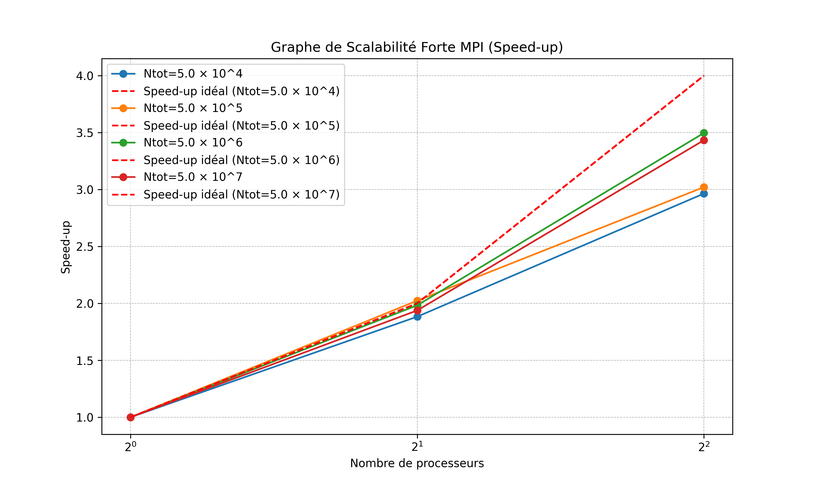
### Analyse de la scalabilité forte (MPI)

1. **Petite taille totale de travail ((Ntot = 5 * 10^4\)) :**
   - **Performance** : Le Speed-up est faible et s'écarte rapidement du speed-up idéal dès que le nombre de processeurs augmente.
   - **Causes** : 
     - Les coûts de communication surpassent les bénéfices du parallélisme pour un faible volume de travail total.
     - La surcharge de synchronisation entre les processeurs réduit l'efficacité.

2. **Taille intermédiaire de travail ((Ntot = 5 * 10^5\)) :**
   - **Performance** : La performance est modérée. Le Speed-up suit la courbe idéale pour 2 processeurs, mais l'écart avec le speed-up idéal augmente légèrement avec 4 processeurs.
   - **Causes** :
     - Le ratio calcul/communication commence à s'améliorer, mais les coûts de communication restent perceptibles avec davantage de processeurs.

3. **Grande taille totale de travail ((Ntot = 5 * 10^6\)) :**
   - **Performance** : La performance est très satisfaisante. Le Speed-up est proche de l'idéal pour 2 et 4 processeurs.
   - **Causes** : 
     - Une charge de calcul suffisamment élevée permet d’amortir les coûts de communication.
     - Le parallélisme est mieux exploité à ce niveau.

4. **Très grande taille totale de travail ((Ntot = 5 * 10^7\)) :**
   - **Performance** : Excellente performance. Le Speed-up est proche de l'idéal même pour 4 processeurs.
   - **Causes** : 
     - Le temps de calcul domine largement les coûts de communication, rendant le modèle MPI extrêmement efficace pour ces charges élevées.

### Causes principales :
- **Latence des communications** : Domine pour les charges totales faibles, entraînant un mauvais Speed-up.
- **Ratio calcul/communication** : Plus favorable pour les tailles totales de travail élevées, ce qui améliore les performances.
- **Surcharge de synchronisation** : Problématique lorsque la charge de travail est faible, car la communication devient un goulet d'étranglement.

### Conclusion :
Le modèle MPI en mode scalabilité forte est inefficace pour les faibles volumes de travail total, où les coûts de communication dominent. Cependant, il est performant pour les charges élevées, où les calculs intenses compensent largement la latence et les surcharges de communication.

### Expérience 2 : calcul de la stabilité faible (Code : MPIscal : Nombre de Points : 5* 10^4,10^5,10^6,10^7   Nombre de processeurs : 1,2,4)

| PI       | Difference | Error    | Ntot              | AvailableProcessors | TimeDuration (ms) | Efficacité (%)
|----------|------------|----------|-------------------|---------------------|-------------------| --------------|
3.137248|-0.004345|0.005276|50000.0|1.0|26.519108|100.0
3.141028|-0.000565|0.005315|100000.0|2.0|32.161975|41.227424621777736
3.141821|0.000229|0.002629|200000.0|4.0|54.529162|12.158222787285819
3.140914|-0.000679|0.001458|500000.0|1.0|320.934415|100.0
3.140815|-0.000778|0.001231|1000000.0|2.0|351.283193|45.680297463021525
3.141659|6.7e-05|0.00134|2000000.0|4.0|360.313106|22.26774502895823
3.141649|5.7e-05|0.000221|5000000.0|1.0|3127.789998|100.0
3.141721|0.000128|0.000294|10000000.0|2.0|3370.606709|46.39802664678076
3.141516|-7.7e-05|0.000344|20000000.0|4.0|4030.214763|19.402129799106195
3.141648|5.5e-05|0.000167|50000000.0|1.0|37469.958162|100.0
3.14173|0.000138|0.000157|100000000.0|2.0|42414.340329|44.17133199685842
3.141579|-1.4e-05|0.000129|200000000.0|4.0|47182.224178|19.853853233285786

### Observations du graphe
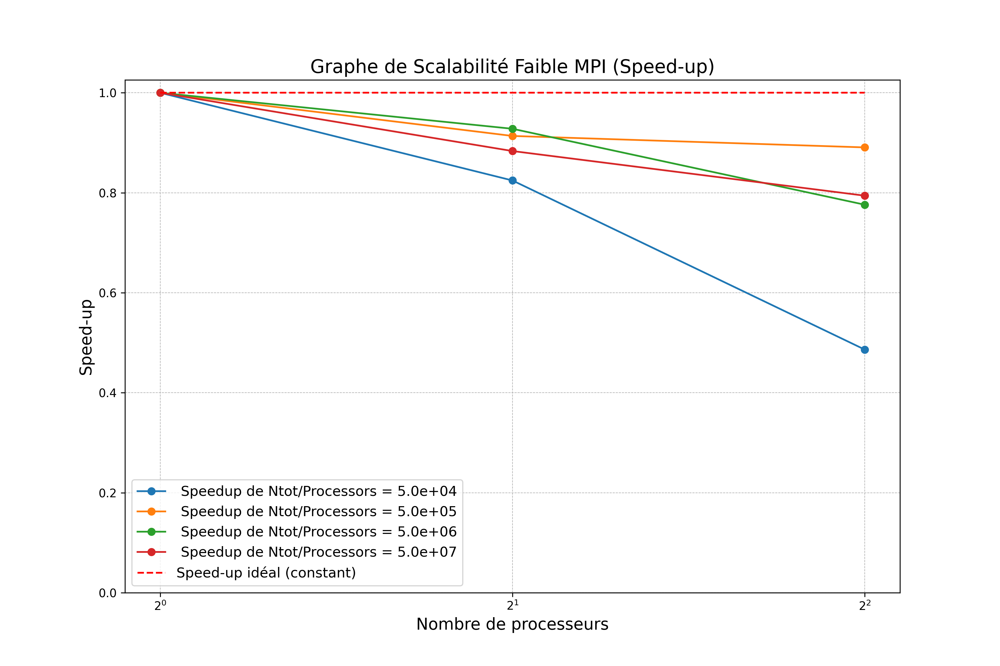
### Analyse de la scalabilité faible (MPI)

1. **Charges faibles (\(Ntot / Processors =  5* 10^4\)) :**
    - **Performance** : La performance est très médiocre, le Speed-up chute rapidement avec l'augmentation des processeurs.
    - **Causes** : Les coûts de communication (latence, synchronisation) surpassent largement les bénéfices du parallélisme.

2. **Charges intermédiaires (\(Ntot / Processors = 5*10^5\)) :**
    - **Performance** : Très bonne performance, le Speed-up se rapproche du speed-up idéal, surtout que la scalabilite stagne entre 2 processus et 4 processus.
    - **Causes** : Le ratio calcul/communication est plus équilibré et il y aussi de l'aléatoire dans l'algo de MonteCarlo car normalement plus il y aura de calculs longs plus le cout de communication sera minime.

3. **Charges  élevées (\(Ntot / Processors = 5*10^6\)) :**
    - **Performance** : Résultat correcte , Le speed-up pour 2 processus est excellent et se rapproche du speed-up idéal mais le speed up pour 4 processus descend drastiquement Le côut en communication à ce moment là doit devenir trop élevé.
    - **Causes** : Coût de communication toujours significatif.

4. **Charges très élevées (\(Ntot / Processors = 5*10^7\)) :**
    - **Performance** : Très bonne performance, le Speed-up se rapproche du speed-up idéal, car le temps de calcul compense largement les coûts de communication.

#### Causes principales :
- **Ratio calcul/communication** : Amélioré pour des charges élevées, permettant d'atteindre une meilleure performance.

#### Conclusion :
Le modèle  MPI en MasterWorker  est inefficace pour les charges faibles mais performant pour les charges élevées, où le temps de calcul amortit les coûts de communication.

#### Comparaison du trust

##### Légende : Graphe des erreurs MPI master Socket 
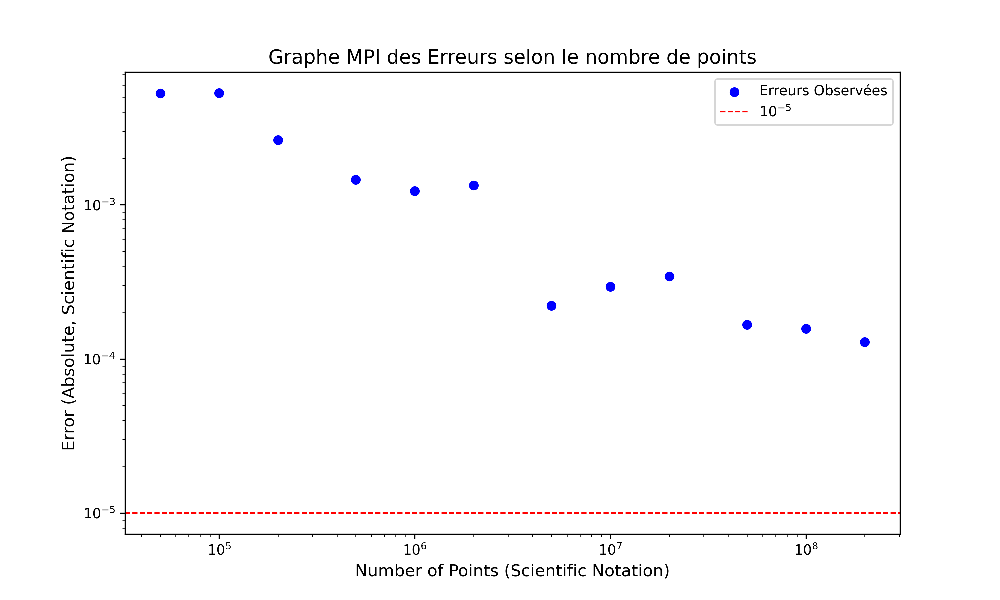

### Analyse du graphe MPI des erreurs selon le nombre de points

1. **Observation générale :**
   - Le graphe montre une décroissance des erreurs absolues (en notation scientifique) en fonction du nombre de points utilisés dans le calcul.
   - Les erreurs observées diminuent progressivement et tendent vers une limite inférieure représentée par la ligne rouge (valeur de référence à \(10^{-5}\)).

2. ** L'analyse des erreurs en fonction du nombre de points**

- **Petit nombre de points (10^5 à 10^6)** : Les erreurs sont relativement grandes (10^-3 à 10^-4) en raison de l'approximation grossière causée par un nombre limité de points utilisés.
  
- **Nombre intermédiaire de points (10^6 à 10^7)** : Les erreurs diminuent de manière significative, atteignant 10^-4, ce qui montre que l'augmentation du nombre de points améliore la précision de l'estimation.

- **Grand nombre de points (10^7 à 10^8)** : Les erreurs continuent de se réduire, approchant la limite théorique de 10^-5, indiquant que le modèle atteint une précision optimale avec un grand nombre de points.

- **Ligne de référence (10^-5)** : Même avec un nombre très élevé de points, l'erreur ne descend pas sous cette limite théorique, ce qui suggère des limitations intrinsèques du modèle ou de la méthode.

**Interprétation** :
- **Tendance** : L'erreur suit une loi inverse par rapport à la racine carrée du nombre de points (1/√N), typique des méthodes de Monte Carlo ( donc plus il y a de points plus l'erreur baisse).
- **Limites** : Après un certain seuil, la réduction des erreurs devient marginale. Pour atteindre une erreur de 10^-9, il faudrait environ 10^16 points, un nombre astronomique de calculs, rendant cette précision pratiquement inatteignable avec des moyens conventionnels (il faudrait des milliers de machines).

### Conclusion:

- **Scalabilité forte** : Le modèle MasterSocket MPI montre de bonnes performances dans des scénarios où la charge reste fixe et le nombre de threads augmente, grâce à une gestion efficace de la mémoire distribuée et des communications via les sockets.

- **Scalabilité faible** : Lorsque la charge augmente proportionnellement au nombre de threads, MasterSocket maintient des performances stables, indiquant une bonne capacité d’adaptation à des charges croissantes.

- **Trust** : MasterSocket calcule la valeur de Pi avec une précision acceptable, indiquant une gestion fiable des calculs parallélisés.

### **. Nouvelle Architecture du paradigme Master Worker en utilisant MPI avec 2 clusterHat**

Pour maximiser les performances et exploiter pleinement les ressources disponibles, nous utilisons les deux ClusterHAT dans cette architecture pour exécuter mpiScal.py. Cette configuration permet d'augmenter la puissance de calcul en tirant parti des 16 workers disponibles (4 sur le Raspberry Pi 4 maître, 8 sur les Raspberry Pi Zero des ClusterHAT, et 4 sur le deuxième Raspberry Pi 4).

Mpiscal.py présente une bonne scalabilité. Il tire avantage d’une architecture distribuée, car les calculs pour déterminer les nombres premiers peuvent être efficacement divisés entre plusieurs nœuds.
Bien que Mpiscal.py ne soit pas parfaitement scalable, sa répartition sur 16 workers réduit tout de même le temps d’exécution global, notamment pour des plages de calcul importantes.


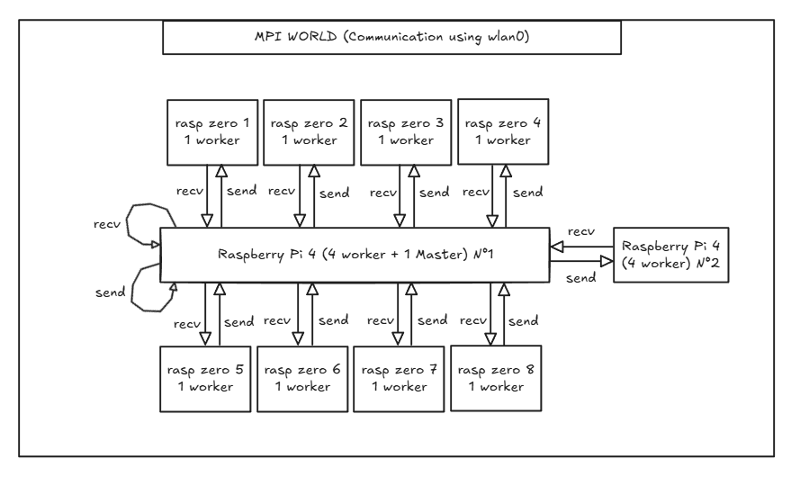

### 1. **Architecture générale :**  
- L'architecture est centrée sur un **Raspberry Pi 4 maître (n°9)**, qui inclut 4 processus travailleurs.  
- **Huit Raspberry Pi Zero (n°1 à 8)**, chacun doté d'un processus de travail, sont connectés au Raspberry Pi 4 maître via un ClusterHAT.  
- Un **deuxième Raspberry Pi 4 (n°2)**, contenant 4 processus travailleurs, est également connecté au maître (n°9).  

### 2. **Communication entre les nœuds :**  
- **Entre le maître (n°9) et les Raspberry Pi Zero :**  
  Le maître envoie des tâches aux Raspberry Pi Zero (n°1 à 8) via WLAN et reçoit les résultats après exécution.  
- **Entre le maître et le second Raspberry Pi 4 (n°2) :**  
  Le maître distribue également des tâches au Raspberry Pi 4 (n°2), qui travaille avec ses 4 processus.  

### 3. **Fonctionnement par configuration du nombre de workers :**  
L'architecture MPI s'adapte dynamiquement au nombre de workers activés :  

- **4 workers :**  
  Seul le Raspberry Pi 4 maître (n°9) travaille. Ses 4 processus exécutent les tâches localement sans communication externe, idéal pour des tâches simples.  

- **8 workers :**  
  Le Raspberry Pi 4 maître (n°9) utilise ses 4 processus et collabore avec les 4 Raspberry Pi Zero (n°1 à 4) du premier ClusterHAT.  

- **16 workers :**  
  Tous les nœuds sont activés :  
  - Le maître (n°9) et ses 4 processus.  
  - Les 8 Raspberry Pi Zero (n°1 à 8).  
  - Le second Raspberry Pi 4 (n°2) avec ses 4 processus.  

### 4. **Exécution typique :**  
1. **Initialisation :**  
   Le maître initialise l'environnement MPI et distribue les tâches aux workers.  

2. **Distribution des tâches :**  
   - Le maître envoie des sous-tâches aux Raspberry Pi Zero et au Raspberry Pi 4 (n°2).  
   - Chaque nœud exécute sa sous-tâche.  

3. **Retour des résultats :**  
   Les résultats sont renvoyés au maître, qui les consolide pour produire une solution globale.  

### 5. **Points forts :**  
- **Scalabilité :** Facilité d'ajouter des nœuds pour augmenter les capacités.  
- **Efficacité :** Division claire des tâches pour optimiser l'utilisation des ressources.  
- **Simplicité :** Modèle maître-travailleur adapté aux réseaux WLAN.  

### 6. **Limites potentielles :**  
- **Latence réseau :** Les communications WLAN peuvent ralentir l'exécution.  
- **Charge sur le maître :** Risque de goulet d'étranglement si trop de nœuds sont ajoutés.

### Expérience 3 : calcul de la stabilité forte (Code : MPIscal : Nombre de Points : 5* 10^4,10^5,10^6,10^7   Nombre de processus : 1,2,4,8,16)

| PI       | Difference | Error   | Ntot              | AvailableProcessors | TimeDuration (ms) | Efficacité (%)
|----------|------------|---------|-------------------|---------------------|-------------------| --------------|
3.142608| 0.001015   |0.007344|50000.0|1.0|37.422085|100.0
3.141024| -0.000569  |0.007104|50000.0|2.0|25.095677|74.55882740282321
3.138088| -0.003505  |0.007733|50000.0|4.0|15.58435|60.031513986788035
3.140096| -0.001497  |0.006112|50000.0|8.0|1073.192072|0.4358735725919526
3.139704|-0.001889|0.001133|16.0|195.841813|1.1942701492964631
3.141202| -0.000391  |0.001691|500000.0|1.0|338.726258|100.0
3.141466| -0.000127  |0.001399|500000.0|2.0|182.802701|92.64804517303055
3.14128| -0.000313  |0.001429|500000.0|4.0|118.227005|71.6262452051458
3.141861| 0.000268   |0.000915|500000.0|8.0|1214.699149|3.4857011536442593
3.375757| 0.234164   |0.234164|500000.0|16.0|661.896801|3.1984428830922838
3.141635| 4.2e-05    |0.000508|5000000.0|1.0|3402.70381|100.0
3.141814| 0.000221   |0.000468|5000000.0|2.0|1720.668626|98.87737123185043
3.141701| 0.000109   |0.00099|5000000.0|4.0|897.798014|94.75137383184277
3.141548| -4.5e-05   |0.000571|5000000.0|8.0|1818.881607|23.38458834335774
3.377335| 0.235742   |0.235742|5000000.0|16.0|3697.306514|5.7519977670155376
3.141545| -4.7e-05   |0.000175|50000000.0|1.0|34392.814136|100.0
3.141646| 5.3e-05    |0.000132|50000000.0|2.0|18645.107436|92.23013129330194
3.141603| 1e-05      |0.00015|50000000.0|4.0|10480.250096|82.04196899157662
3.14155| -4.3e-05   |0.000201|50000000.0|8.0|17321.890807|24.818894281810607
3.138944|-0.002649|0.001302|50000000.0|16.0|34429.106164|6.243411819234589

### Observations du graphe
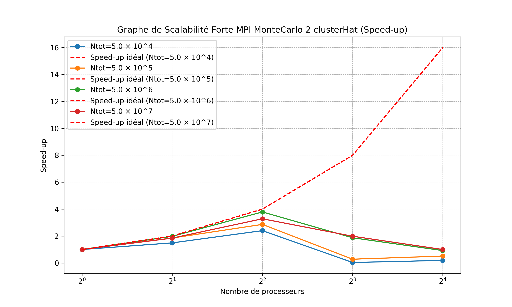

### Analyse du graphique de scalabilité forte

1. **Tendances observées :**
   - **Petits problèmes ((N_{text{tot}} = 5.0  * 10^4) et (5.0 * 10^5)) :** Le speed-up plafonne rapidement car le temps de calcul est trop faible par rapport au coût de communication.
   - **Grands problèmes ((N_{text{tot}} = 5.0  * 10^6) et (5.0 * 10^7)) :** Le speed-up est meilleur, mais diminue après 4 processeurs.

2. **Impact du WLAN :**
   - Lorsque plus de 4 processeurs sont utilisés, les communications impliquent les Raspberry Pi Zero et le second Raspberry Pi 4 via le WLAN.  
   - Cela entraîne une **augmentation de la latence réseau**, qui devient un facteur limitant, particulièrement visible avec un grand nombre de processeurs.


### Expérience 4 : calcul de la stabilité faible (Code : MPIscal : Nombre de Points : 5* 10^4,10^5,10^6,10^7   Nombre de processus : 1,2,4,8,16)

| PI       | Difference | Error    | Ntot              | AvailableProcessors | TimeDuration (ms) | Efficacité (%)
|----------|------------|----------|-------------------|---------------------|-------------------| --------------|
3.143136|0.001543|0.007312|50000.0|1.0|33.133864|100.0
3.140036|-0.001557|0.005011|100000.0|2.0|39.44118|42.00414896308883
3.142442|0.000849|0.003006|200000.0|4.0|51.031065|16.232202874856718
3.143554|0.001961|0.003016|400000.0|8.0|135.186625|3.063715067966229
3.142543|0.00095|0.000397|800000.0|16.0|1907.62949|0.10855706052227156
3.141947|0.000355|0.00116|500000.0|1.0|351.613736|100.0
3.143122|0.001529|0.001731|1000000.0|2.0|363.190937|48.406182558459605
3.141524|-6.9e-05|0.000869|2000000.0|4.0|386.473012|22.745038145121505
3.141582|-1e-05|0.000633|4000000.0|8.0|1210.748839|3.6301267103672195
3.141922|0.000329|0.000307|8000000.0|16.0|4664.105177|0.4711698743066316
3.141924|0.000332|0.000571|5000000.0|1.0|3628.416276|100.0
3.14167|7.7e-05|0.000431|10000000.0|2.0|3695.44785|49.09305209110176
3.141684|9.1e-05|0.00018|20000000.0|4.0|4251.175928|21.337721241443763
3.141496|-9.6e-05|0.000252|40000000.0|8.0|11536.713457|3.93137990460189
3.141998|0.000406|0.000138|80000000.0|16.0|39329.182029|0.5766100527663734

### Observations du graphe
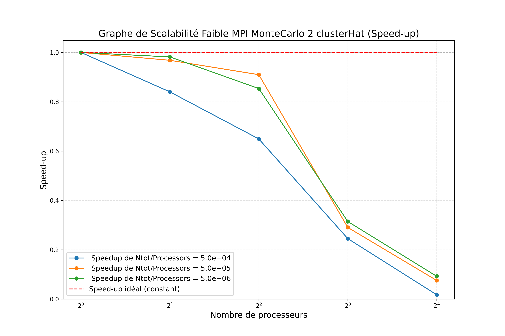
### Analyse du graphique de scalabilité faible

1. **Tendances générales :**  
   - Le speed-up diminue lorsque le nombre de processeurs augmente, ce qui est typique d'une scalabilité faible.   

2. **Impact des communications :**  
   - Lorsque le nombre de processeurs dépasse 4, les communications via le WLAN deviennent un facteur dominant.  
   - Le maître doit gérer davantage de processus, ce qui augmente la surcharge de communication, en particulier avec les Raspberry Pi Zero et le second Raspberry Pi 4.  

3. **Effet de la granularité des calculs :**  
   - Pour des tâches avec un faible ratio calcul/communication ((N_{text{tot}} = 5.0 * 10^4)), le speed-up chute rapidement, car les communications coûtent plus cher que les calculs.  
   - Avec des tâches plus importantes (\(N_{\text{tot}} = 5.0 * 10^5) et (5.0 * 10^6)), la dégradation est plus lente, mais reste significative au-delà de 8 processeurs.  

### Comparaison du trust

#### Observations du graphe
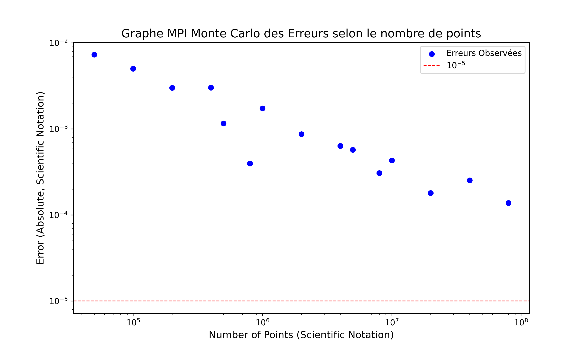

Ce graphe illustre la diminution de l'erreur absolue (en notation scientifique) en fonction du nombre de points utilisés dans une méthode Monte Carlo MPI. Voici une analyse rapide :

Tendance générale : L'erreur diminue régulièrement lorsque le nombre de points augmente, ce qui est attendu dans une méthode Monte Carlo. Plus d'échantillons améliorent la précision.

Échelle logarithmique : L'échelle montre une réduction quasi-exponentielle de l'erreur, typique de ces méthodes où l'erreur est souvent proportionnelle à 1 sur la racine carrée du nombre de points.

Observation des points : Les points bleus montrent des erreurs stables, avec une faible dispersion pour chaque taille d'échantillon.

## Conclusion : 

La nouvelle architecture est quasiment équivalente à l'ancienne en termes de scalabilité forte et faible, bien qu'elle soit légèrement moins performante. Cependant, dès que le nombre de processus dépasse 4, la scalabilité chute fortement, principalement à cause des coûts de communication élevés et des déséquilibres dans la répartition des tâches. Par ailleurs, pour atteindre une erreur inférieure à 10⁻⁸, il faudrait traiter un nombre de points extrêmement élevé, ce qui nécessiterait un grand nombre de machines, rendant cette approche difficilement praticable.
