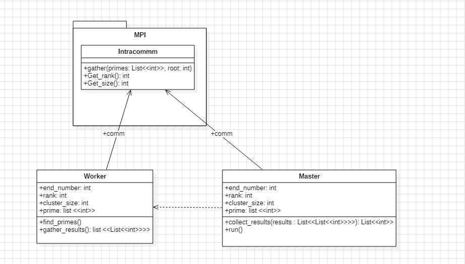
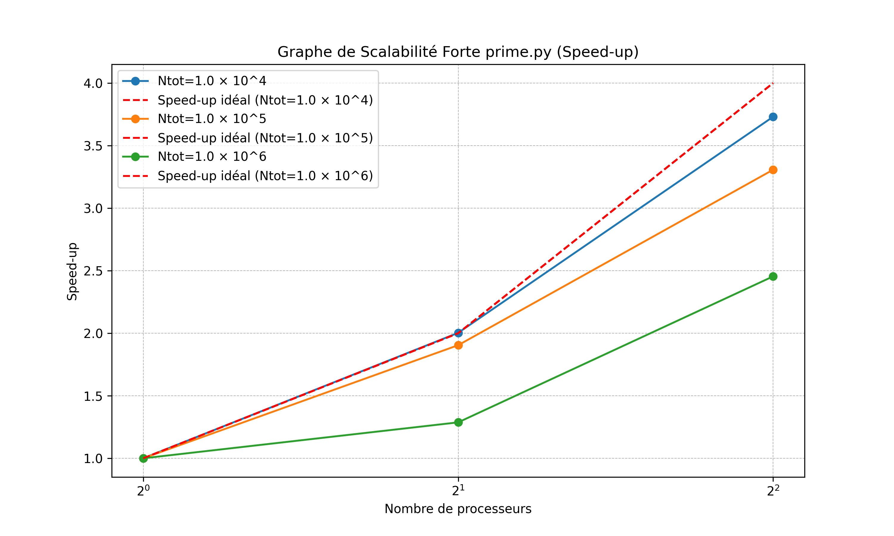
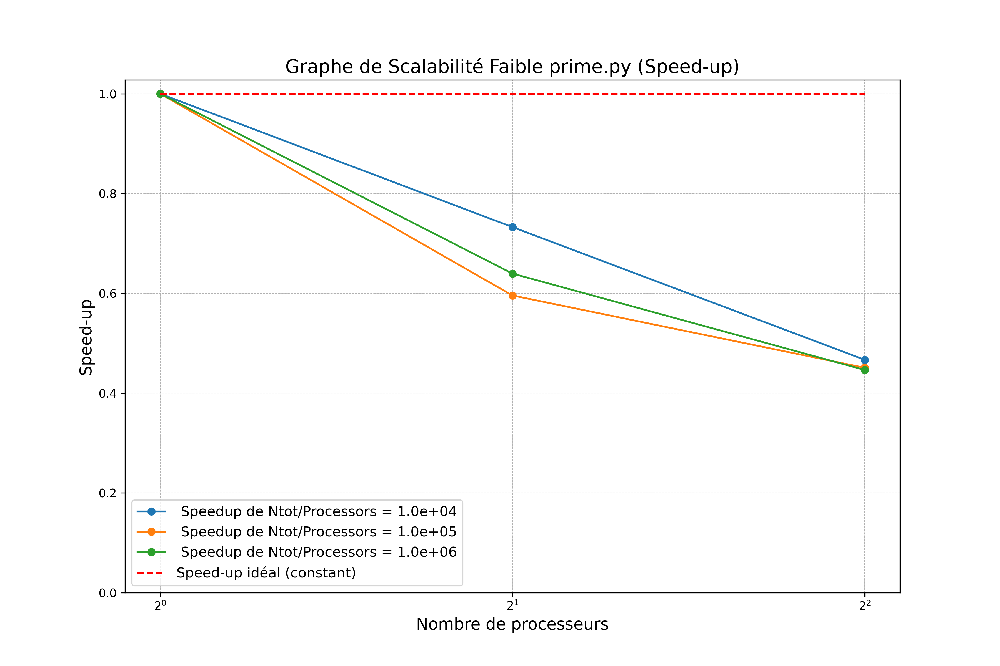
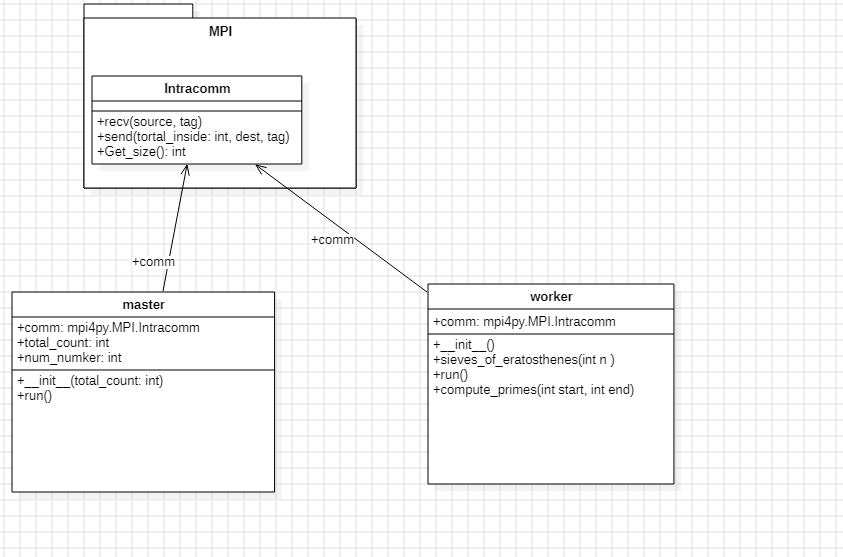
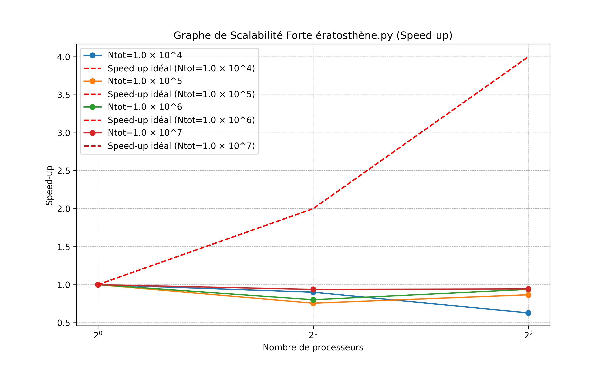
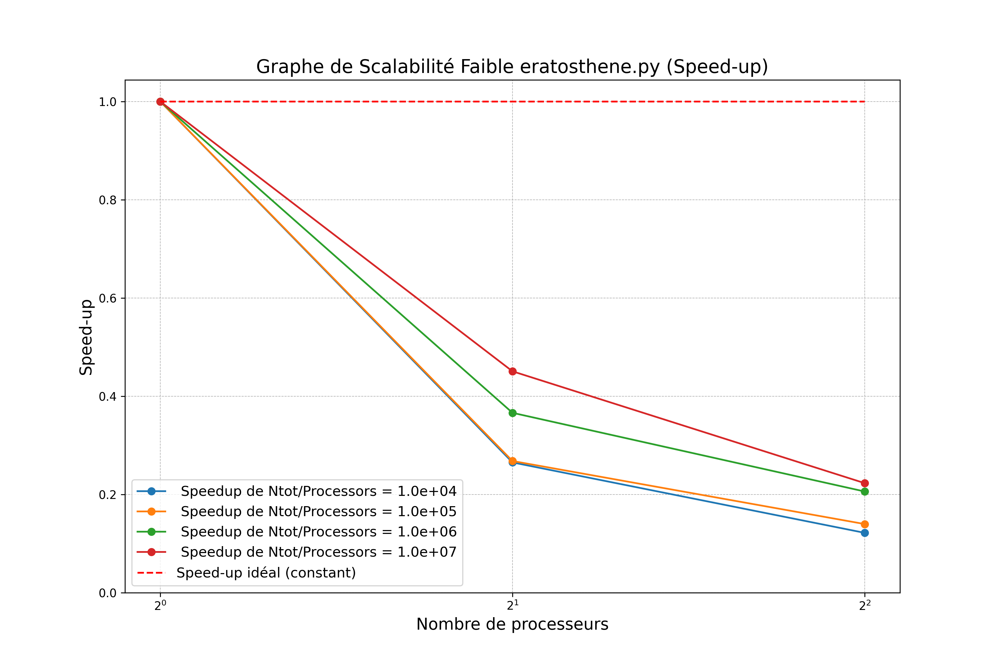
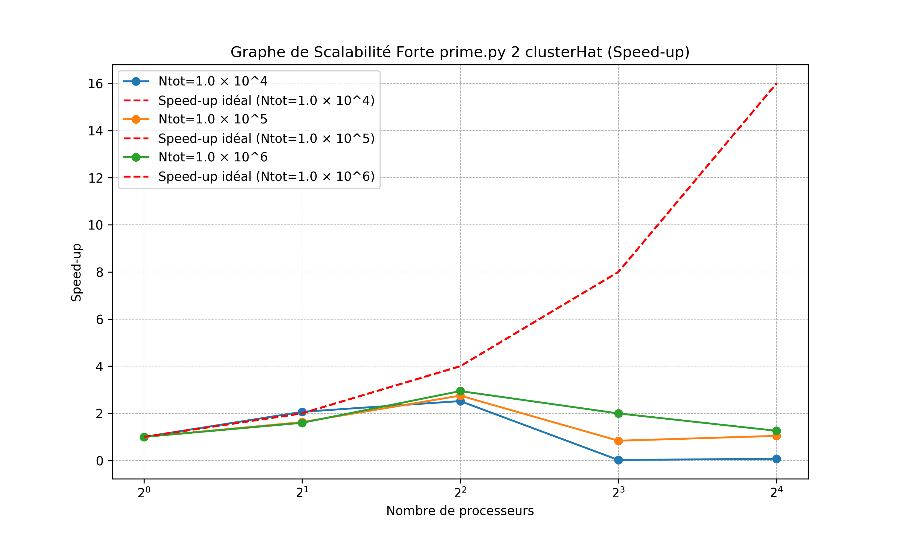
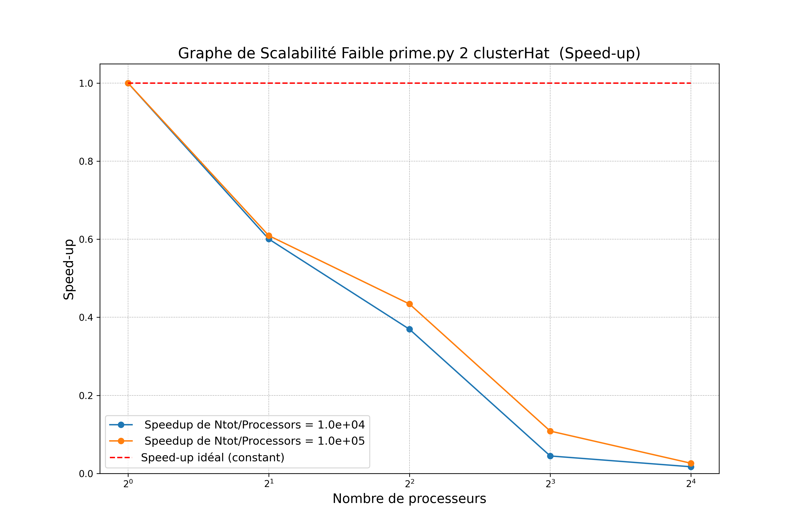

# Rapport : Implémentation et Analyses de la Performance et de la Scalabilité de la divisibilité simple et de la crible d'ératosthène

## Introduction

Ce rapport présente les travaux réalisés dans le cadre de notre SAE, combinant analyses théoriques et implémentations pratiques. Il s'appuie sur des notes personnelles et a été partiellement rédigé avec l'aide de ChatGPT pour structurer et formuler certaines sections.

Les travaux explorent plusieurs aspects de la programmation parallèle et distribuée. La méthode de divisibilité simple et la crible d'ératosthène est utilisée pour estimer les nombres premiers, avec une analyse détaillée des algorithmes et des techniques de parallélisation mises en œuvre. L'implémentation est effectuée sur une machine à mémoire distribuée au sein du cluster HAT, composé d'un Raspberry Pi Zero et de quatre Raspberry Pi 4.

Ce projet s'inscrit également dans une démarche visant à vérifier la conformité aux normes ISO pertinentes en matière de calcul distribué et de bonnes pratiques de programmation, tout en développant des compétences applicables aux environnements professionnels.


## I. Le test de Divisibilité simple pour calculer les nombres premiers 

 La méthode utilisé repose sur un test de divisibilité simple pour déterminer si un nombre est premier. Pour chaque nombre candidat N, l'algorithme tente de le diviser par tous les entiers compris entre 2 et N-1. Si, pour l'un de ces diviseurs d, l'opération N mod d = 0 (c'est-à-dire que le reste de la division de N par d est égal à zéro), alors N est divisible par d et n'est donc pas premier. Un nombre premier, par définition, est un nombre qui n'a aucun diviseur autre que 1 et lui-même. En d'autres termes, un nombre N est premier si et seulement s'il n'est divisible par aucun nombre d compris entre 2 et N-1. 
 un test de divisibilité simple a une complexité quadratique (O(n²)). Cela vient du fait qu'on vérifie chaque nombre N en testant tous les diviseurs de 2 à N - 1

### Amélioration de la Complexité
Il n'est pas nécessaire de tester tous les diviseurs jusqu'à N-1. Tester uniquement jusqu'à la racine carrée de N suffit, car tout diviseur supérieur à cette valeur aura un diviseur correspondant inférieur ou égal à la racine carrée. Cela réduit la complexité d'un test de divisibilité de O(N) à O(√N).
## II. Algorithme et parallélisation.

```less
Initialiser liste_primes comme une liste vide

Pour i de 2 à racine de N faire
    // Vérifie si i est premier
    Si i <= 1 alors
        Passer à l'itération suivante  // Les nombres inférieurs ou égaux à 1 ne sont pas premiers
    Fin Si

    Pour d de 2 à i-1 faire
        Si i mod d = 0 alors
            Passer à l'itération suivante  // i est divisible par d, donc i n'est pas premier
        Fin Si
    Fin Pour

    // Si on n'a trouvé aucun diviseur, on considère i comme premier et on l'ajoute à la liste
    liste_primes.append(i)
Fin Pour

Retourner liste_primes  // Retourne la liste des nombres premiers trouvés jusqu'à N
Fin Algorithme

```

### Algorithme de Test de Divisibilité Simple - Décomposition en Tâches


#### Tâches

1. **T0 : Vérifier les nombres dans la plage donnée (N)**
    - **T0p : Vérifier un nombre**
        1. **T0p1 : Vérifier si le nombre est premier**
        2. **T0p2 : Ajouter le nombre à la liste des premiers si c'est un nombre premier**

2. **T1 : Retourner la liste des nombres premiers**


#### Indépendances entre les instances de sous-tâches
- **T0p1 (Vérification de la primalité) :** 
    - Les instances de T0p1 sont indépendantes entre elles, car chaque nombre \(N\) est testé indépendamment des autres.
- **T0p2 (Ajout à la liste des premiers) :** 
    - Les instances de T0p2 sont indépendantes entre elles, car chaque ajout à la liste est effectué uniquement pour un nombre donné \(N\) sans interférer avec d'autres nombres.

#### Dépendances entre les tâches

- **T1 dépend de T0 :** 
    - La tâche T1, qui consiste à retourner la liste des nombres premiers, dépend de T0, car elle ne peut être exécutée qu'après que T0 ait vérifié tous les nombres.
  
- **T0p2 dépend de T0p1 :**
    - La tâche T0p2, qui consiste à ajouter un nombre à la liste des premiers, dépend de T0p1, car elle ne peut être exécutée que si T0p1 a déterminé qu'un nombre est premier.


#### Ressource et Section Critique

- **Ressource critique :** 
    - La **liste des nombres premiers** est une ressource critique car plusieurs tâches peuvent potentiellement y accéder simultanément. L'accès à cette ressource doit être bien synchronisé pour éviter les conflits d'écriture.
  
- **Section critique :**
    - La section critique est **l'ajout du nombre à la liste des premiers** dans T0p2. Lorsqu'un nombre est trouvé premier, il doit être ajouté à la liste des premiers de manière atomique pour éviter des problèmes de concurrence.


### Conclusion 
Nous pouvons en conclure que les instances de TO  peuvent être entièrement parallélisées, car elles sont indépendantes les unes des autres, il faudra juste s'occuper de ToP2 qui  est une section critique du code.

###  Paradigme Master Worker

#### Explication du paradigme Master Worker

Dans le paradigme Master/Worker, le travail est réparti en plusieurs tâches distinctes, chacune étant assignée à un processus ou un thread appelé "Worker". Chaque Worker traite de manière autonome une portion du travail de manière itérative, et à la fin de son exécution, les résultats obtenus sont collectés et combinés par un processus central, le "Master". Ce dernier a la responsabilité de coordonner l'ensemble du processus, de gérer l'attribution des tâches aux Workers, ainsi que de rassembler et d'interpréter les résultats pour produire la sortie finale. Ce modèle permet de paralléliser les calculs, optimisant ainsi les performances dans les systèmes distribués ou multi-threadés.
####  Image : Schéma de MasterWorker

### a. Paradigme Master Worker : Test de Divisibilité
Voici l'algorithme de test de divisibilité avec un paradigme **Master/Worker** en pseudo-code :

#### Initialisation

- **Master :**
    - Initialiser une liste vide `liste_primes`
    - Définir la plage de nombres à vérifier de 2 à racine de  N.
    - Diviser cette plage de nombres en sous-plages, chaque sous-plage sera assignée à un Worker.


#### Tâches

1. **Master :** Distribuer les sous-plages de nombres aux Workers
    - Pour chaque Worker, attribuer une plage de nombres à traiter.
  
2. **Worker :** Vérifier la primalité pour les nombres dans sa plage
    - Pour chaque nombre (i) dans la plage de nombres :
        - Vérifier si (i < 1) (si oui, passer à l'itération suivante).
        - Pour chaque diviseur (d) de 2 à (i-1) :
            - Si (i mod d = 0), ce n'est pas un nombre premier, donc passer à l'itération suivante.
        - Si aucun diviseur n'a été trouvé, ajouter (i) à la liste des nombres premiers.
  
3. **Master :** Collecter les résultats des Workers
    - Lorsque tous les Workers ont terminé, le Master collecte les résultats (les nombres premiers trouvés) de chaque Worker.

4. **Master :** Fusionner et retourner la liste des nombres premiers
    - Fusionner les résultats des Workers dans une seule liste des nombres premiers.
    - Retourner la liste des nombres premiers.

### Pseudo-Code

```pseudo
// Initialisation par le Master
Initialiser liste_primes comme une liste vide
Définir la plage de nombres à vérifier de 2 à N
Diviser la plage en sous-plages égales entre les Workers

// Master : Distribuer la plage aux Workers
Pour chaque Worker dans les Workers
    Assigner une sous-plage de nombres à vérifier

// Worker : Vérification de primalité
Pour chaque nombre i dans la plage assignée :
    Si i <= 1 alors
        Passer à l'itération suivante
    Fin Si
    
    Pour chaque diviseur d de 2 à i-1 :
        Si i mod d = 0 alors
            Passer à l'itération suivante
        Fin Si
    Fin Pour

    Ajouter i à la liste des nombres premiers (si i est premier)

Fin Pour

// Master : Collecte des résultats des Workers
Pour chaque Worker
    Recevoir les nombres premiers trouvés

// Master : Fusionner les résultats
Fusionner les listes des nombres premiers trouvés par chaque Worker

// Master : Retourner la liste des nombres premiers
Retourner liste_primes
```

### Explication :

1. **Master** :
   - Divise la plage de nombres (de 2 à racine de N) en plusieurs sous-plages.
   - Assigne chaque sous-plage à un **Worker**.

2. **Worker** :
   - Chaque **Worker** vérifie la primalité des nombres dans sa plage assignée.
   - Si un nombre est premier, il est ajouté à la liste locale de ce **Worker**.
   - Une fois tous les nombres vérifiés, le **Worker** renvoie sa liste des nombres premiers au **Master**.

3. **Master** :
   - Le **Master** collecte les résultats de tous les **Workers**.
   - Fusionne toutes les listes de nombres premiers reçues.
   - Retourne la liste complète des nombres premiers.


## 3.Mise en oeuvre sur Machine à mémoire distribué

Après avoir expliqué le pseudo-code du méthode de Test de divisibilité et son principe de parallélisation, l'étape suivante consiste à la mettre en œuvre sur notre cluster distribué, composé de plusieurs Raspberry Pi. Ce cluster se compose de deux types de machines: d'un Raspberry Pi 4 (plus puissant) et de 4 Raspberry Pi 0 (moins puissants).

### **.  Architecture du paradigme Master Worker en utilisant MPI**

Ce schéma représente une architecture **Master-Worker** utilisant **MPI (Message Passing Interface)** pour la communication entre un Raspberry Pi 4 (le *master*) et quatre Raspberry Pi Zero (les *workers*). L'objectif est de répartir des tâches de calcul ou de traitement entre plusieurs unités de calcul pour optimiser les performances.

#### **Architecture :**
1. **Master :**
   - Le Raspberry Pi 4 agit comme un **coordinateur principal** (master).
   - Il gère la distribution des tâches aux *workers* et collecte leurs résultats.

2. **Workers :**
   - Chaque Raspberry Pi Zero joue le rôle d’un **worker**.
   - Ils sont chargés de recevoir des tâches, de les exécuter, puis de renvoyer les résultats au *master*.

3. **Réseau MPI :**
   - Tous les Raspberry Pi sont connectés via un réseau local (par exemple, Wi-Fi ou Ethernet).
   - La communication est orchestrée par **MPI.COMM.WORLD**, qui attribue un identifiant unique (**rank**) à chaque processus dans le réseau.

#### **Communication entre les Raspberry Pi :**
1. **Échange de données :**
   - Le *master* utilise des fonctions MPI pour **envoyer des tâches** aux *workers* (`send`) et pour **recevoir les résultats** (`recv`).
   - Les *workers* reçoivent les données (`recv`), effectuent les calculs, puis envoient les résultats au *master* (`send`).

2. **Processus synchronisé :**
   - Le *master* peut envoyer des tâches spécifiques à chaque *worker* en utilisant leurs identifiants uniques (**ranks**).
   - Par exemple, le *master* (rank 0) envoie des instructions aux *workers* (ranks 1 à 4) et attend les réponses.

### **Exemple d’exécution :**
1. Le *master* envoie des tâches spécifiques à chaque *worker* (par exemple, un calcul mathématique ou un traitement de données).
2. Chaque *worker* exécute sa tâche indépendamment.
3. Une fois le travail terminé, les *workers* renvoient les résultats au *master*.
4. Le *master* collecte les résultats, les combine, ou les utilise pour d'autres opérations.

Cette architecture permet de **répartir les calculs** entre plusieurs appareils. on utilise la même architecture pour la crible d'ératosthène.

###  a. Analyse de prime.py


### **1. Composants principaux**

1. **MPI** :
   - Contient une classe `Intracomm` avec des méthodes :
     - `comm.gather()` : Cette méthode est utilisée pour collecter les résultats de tous les **Workers** sur le **Master**. Les **Workers** renvoient leurs résultats sous forme de liste, et le **Master** les fusionne pour obtenir tous les nombres premiers trouvés.
     - `comm.Get_rank()` : Cette méthode permet au **Master** et aux **Workers** de connaître leur rang respectif dans le groupe MPI. Le rang détermine la plage de nombres à tester pour chaque processus.
     - `comm.Get_size()` : Cette méthode permet au **Master** et aux **Workers** de savoir combien de processus MPI (ou **Workers**) sont utilisés dans le calcul.

2. **Master** :
   - Attributs :
     - `comm: mpi4py.MPI.Intracomm` : L'instance de communicateur pour la communication entre le **Master** et les **Workers** via MPI.
     - `end_number: int` : La limite supérieure de la plage de nombres à tester pour les nombres premiers.
     - `my_rank: int` : Le rang du processus actuel (le **Master** a un rang de 0, tandis que les **Workers** ont des rangs supérieurs).
     - `cluster_size: int` : Le nombre total de processus MPI (y compris le **Master** et les **Workers**).
     - `start_time: float` : Le temps de démarrage du calcul pour mesurer la durée de l'exécution.
   - Méthodes :
     - `__init__(end_number: int)` : Le constructeur initialise les attributs, en incluant la taille du cluster et le rang du processus actuel.
     - `collect_results(results)` : Cette méthode fusionne les résultats provenant des **Workers**. Elle trie la liste des nombres premiers trouvés avant de les retourner.
     - `run()` : La méthode principale du **Master** qui coordonne le processus, crée des instances de **Worker**, et recueille les résultats des **Workers** via la méthode `gather_results`.

3. **Worker** :
   - Attributs :
     - `comm: mpi4py.MPI.Intracomm` : L'instance de communicateur pour la communication entre les **Workers** et le **Master** via MPI.
     - `my_rank: int` : Le rang du **Worker** dans le groupe MPI.
     - `cluster_size: int` : Le nombre total de processus MPI.
     - `primes: list` : Une liste pour stocker les nombres premiers trouvés par ce **Worker**.
     - `end_number: int` : La limite supérieure de la plage de nombres à tester pour la recherche de nombres premiers.
   - Méthodes :
     - `__init__(end_number: int)` : Le constructeur initialise les attributs, en particulier les informations sur la plage de nombres à tester et le rang du **Worker**.
     - `find_primes()` : Cette méthode fait la recherche des nombres premiers dans la plage assignée au **Worker** en fonction de son rang.
     - `gather_results()` : Cette méthode utilise `comm.gather()` pour renvoyer les résultats trouvés par le **Worker** (les nombres premiers) au **Master**.

### **2. Interactions entre les classes**

- **Communication MPI** :
  - La classe **Master** utilise `MPI.COMM_WORLD`, une instance de `mpi4py.MPI.Intracomm`, pour coordonner la communication avec les **Workers**. Elle rassemble les résultats des **Workers** via la méthode `gather_results` de chaque **Worker**. Elle envoie également les informations nécessaires aux **Workers**, telles que la limite supérieure (`end_number`) pour la recherche des nombres premiers.
  - La classe **Worker** utilise également `MPI.COMM_WORLD` pour recevoir des informations du **Master**, telles que la plage de nombres à vérifier (en fonction de son rang). Elle renvoie ensuite les résultats (nombres premiers trouvés) au **Master** via la méthode `gather_results`.

- **Recherche des Nombres Premiers** :
  - La méthode `find_primes` de la classe **Worker** effectue un test de divisibilité pour chaque nombre dans sa plage assignée. Chaque **Worker** parcourt une portion de nombres (en fonction de son rang) et vérifie s'ils sont premiers. Si un nombre est premier, il est ajouté à la liste des résultats (`primes`).

- **Coordination et Calcul Final** :
  - La classe **Master** coordonne les tâches en envoyant les informations nécessaires aux **Workers** (comme la plage de nombres à tester). Une fois que les **Workers** ont trouvé les nombres premiers dans leur plage assignée, le **Master** collecte les résultats via `gather_results`. Le processus maître fusionne les résultats des **Workers**, trie les nombres premiers trouvés et affiche les résultats finaux, notamment le nombre total de nombres premiers trouvés et le temps d'exécution.

### **3.Correspondance avec le pseudo-code** 


- **Initialisation par le Master** :  
  - **Tâche : Initialiser le processus principal.**  
  - Correspond à l'initialisation des attributs dans la classe `Master` (`self.end_number`, `self.comm`, `self.my_rank`, etc.) pour configurer la plage des nombres et définir les ressources MPI nécessaires.  

- **Master : Distribuer la plage aux Workers ** :  
  - **Tâche : Diviser le travail entre les Workers.**  
  - Implémenté implicitement dans le code par la méthode `Worker.find_primes()`. Chaque Worker utilise son rang MPI (`self.my_rank`) pour calculer la plage des nombres qu'il doit traiter, ce qui correspond à :  
    ```python
    start_number = (self.my_rank * 2) + 1  
    for candidate_number in range(start_number, self.end_number, self.cluster_size * 2): 
    ```  

- **Worker : Vérification de primalité ** :  
  - **Tâche : Identifier si un nombre est premier.**  
  - Correspond à la méthode `find_primes()` dans la classe `Worker`. Cette méthode utilise deux boucles :  
    - Une pour parcourir les nombres assignés à ce Worker.  
    - Une autre pour vérifier si chaque nombre est divisible par un autre nombre. Cela correspond aux étapes :  
      ```python
      for div_number in range(2, candidate_number):
          if candidate_number % div_number == 0:
              found_prime = False
              break
      ```  
  -  (T0p2)Si aucun diviseur n'est trouvé, le nombre est ajouté à `self.primes`.  

- **Master : Collecte des résultats des Workers** :  
  - **Tâche : Rassembler les listes des nombres premiers trouvées par les Workers.**  
  - Implémenté dans la méthode `Worker.gather_results()`. Chaque Worker envoie ses résultats au processus maître via :  
    ```python
    results = self.comm.gather(self.primes, root=0)
    ```  

- **Master : Fusionner les résultats** :  
  - **Tâche : Combiner toutes les listes en une seule.**  
  - Réalisé dans la méthode `Master.collect_results()`, qui utilise une compréhension de liste pour fusionner et trier les résultats :  
    ```python
    merged_primes = [item for sublist in results for item in sublist]
    merged_primes.sort()
    ```

##  4.Analyse des performances prime.py

Nous comparerons l’efficacité des l'implémentation de prime.py en analysant deux aspects :

**Scalabilité forte** : Elle évalue les performances lorsque le nombre de threads augmente, mais que le nombre total de points reste fixe. Cet aspect permet de voir si chaque implémentation utilise efficacement les ressources multiprocesseurs disponibles.

**Scalabilité faible** : Elle mesure la capacité d’un programme à maintenir des performances constantes lorsque le nombre total de points augmente proportionnellement au nombre de threads. Cela reflète l’efficacité de la gestion des charges de travail croissantes.

Pour les tests, nous choisirons un total de points de 10^4, 10^5, 10^6. Cette sélection permet d’analyser l’impact de la charge de travail sur les performances tout en garantissant une granularité suffisante pour observer les différences. Les valeurs inférieures (10 à 10^3) ne seront pas analysées, car les temps d’exécution sont presque équivalents et peu significatifs. De plus, multiplier par 16 permet de tester la scalabilité avec différents nombres de threads : 1, 2, 4.

Pour le calcul de la scalabilité, nous représentons en abscisse (axe horizontal) le nombre de processeurs/threads utilisés et en ordonnée (axe vertical) le **speedup**.

Le **speedup** mesure l'accélération obtenue grâce à la parallélisation. Il se calcule à l'aide de la formule suivante :

**Speedup = T1 / Tp**,

où :
- **T1** est le temps d'exécution en mode séquentiel (1 thread),
- **Tp** est le temps d'exécution avec *p* threads.

Un speedup idéal (linéaire) en **scalabilité forte** se traduit par une courbe où la valeur double lorsque le nombre de threads double, pour une taille de problème fixe. Cela reflète une parfaite répartition du travail entre les threads.

En **scalabilité faible**, le speedup est observé en augmentant à la fois la taille du problème et le nombre de threads de manière proportionnelle. Ici, un speedup linéaire indique que le système maintient une efficacité constante malgré l'augmentation de la charge.

### Automatisation des tests et leurs traitements

Il ya des scripts  permettant d'automatiser les tests pour évaluer les performances de **scalabilité forte** et **scalabilité faible**.

- **Script `script_scalabilite_forte.bat`** :  
  Ce script divise le nombre total de points (**$TOTAL_POINTS**) de manière fixe et fait varier le nombre de threads (**$THREAD_COUNTS**). Il exécute chaque configuration plusieurs fois (**$REPEAT_COUNT**) pour garantir des mesures fiables. Les résultats sont enregistrés dans des fichiers CSV distincts pour le programme  prime.py.

- **Script `script_scalabilite_faible.bat`** :  
  Ici, le script augmente proportionnellement le nombre total de points avec le nombre de threads. Chaque **thread** traite une charge de travail fixe (**$pointsParTravailleur**), simulant une augmentation uniforme de la taille du problème. Les fichiers CSV collectent les résultats pour analyser l'efficacité parallèle.

Pour le traitement on utilise la classe AverageToCsv qui  permet de calculer la moyenne des résultats pour chaque configuration de test, en regroupant les 20 répétitions effectuées. Cela facilite l'analyse en lissant les données pour chaque expérience.

Avec les résultats obtenus sous forme de fichiers CSV, j'utilise un code Python pour calculer le speed-up et tracer les graphes correspondants. Ce script extrait les données, calcule le speed-up en comparant le temps d'exécution avec un seul processeur à celui avec plusieurs processeurs, et génère un graphique montrant la scalabilité forte et faible, avec une courbe pour chaque valeur unique de Ntot. Les graphes incluent également une référence au speed-up idéal pour évaluer l'efficacité parallèle.

### Architecture matérielle choisie pour lancer les tests

#### Raspeberry PI 4 B
- **Processeur** : 1,5 GHz quadricœur ARM Cortex-A72
   - Cœurs physiques : 4 cœurs
   - Threads : 4 threads (1 par cœur)
   - Fréquence de base : 1,5 GHz
   - Architecture : 64 bits 

- **Mémoire RAM** : 8 Go
#### Raspeberry PI 0 

**Processeur** : 1 GHz monocœur ARM Cortex-A53
- Cœurs physiques : 1 cœur

- Threads : 1 thread

- Fréquence de base : 1 GHz

- Architecture : 32 bits (ARMv6)

**Mémoire RAM** : 512 Mo

### Rapport avec la norme Iso

#### Calcul du Time et du Task Time

Dans l’évaluation des performances, deux approches peuvent être utilisées pour définir le temps cible (Tt) et le temps mesuré (Ta) :

1. **Comparaison avec un code séquentiel**
    - Le temps cible (Tt) est égal au temps d’exécution avec un seul processeur, soit T1.
    - Le temps mesuré (Ta) est égal au temps d’exécution parallèle avec p processeurs, soit Tp.

   Cette approche permet de mesurer directement l’amélioration apportée par le parallélisme par rapport à une exécution séquentielle.

2. **Parallélisme idéal (notre choix)**
    - Le temps cible (Tt) est défini comme Tp, ce qui correspond au temps  idéal, c’est-à-dire le temps théorique si le parallélisme était parfait.
    - Le temps mesuré (Ta) est défini comme Tp, soit le temps réel mesuré avec p processeurs.

   Cette approche permet d’évaluer dans quelle mesure le code parallèle se rapproche du parallélisme idéal.

#### Calcul de l’efficacité selon la norme ISO/IEC 25022:2012

Conformément à la norme ISO/IEC 25022:2012, l’efficacité peut être calculée avec la formule suivante :
- Efficacité = Tt/Ta * 100

    - Tt représente le temps cible, soit Temps idéal paralélle  dans notre cas.
    - Ta représente le temps mesuré, soit Tp.
on pourrait aussi utiliser la 

Cette formule mesure l'efficacité du programme plus le pourcentage est grand mieux c'est.

une autre formule possible pour calculer l'efficacité c'est  (Tt - Ta)/Tt et Tt = (1/p)*T1

La formule du Time correspond à
- TT/ta
 ce qui correspond au speedup précedemment écrit. Le time va comparer le code séquentiel au temps paralléle


### Effectiveness selon la norme ISO/IEC 25022:2012

L’évaluation de l’effectiveness selon la norme ISO/IEC 25022:2012 n’est pas applicable à ce code, car il ne génère pas d’erreur approximative mesurable. Contrairement à des algorithmes d’estimation comme Monte Carlo, ce code détermine de manière déterministe les nombres premiers dans une plage donnée, garantissant un résultat exact si l’implémentation et l’environnement d’exécution sont corrects. De plus, l’idée de mesurer une réduction progressive de l’erreur avec des itérations croissantes est inadaptée ici, car le processus n’est ni itératif ni approximatif. On conclut que la métrique d'erreur n'existe pas.

### Expérience 1 : calcul de la stabilité forte (Code : Prime : Nombre de Points : 10^4,10^5,10^6  Nombre de processus : 1,2,4)

| TotalPrimes     | Ntot              | AvailableProcessors | TimeDuration (ms) | Efficacité (%)
|----------|-------------------|---------------------|-------------------| --------------|
1229.0|10000.0|1.0|58.667262|100.0
1229.0|10000.0|2.0|29.287497|100.15752114289589
1229.0|10000.0|4.0|15.726447|93.2621049115544
9592.0|100000.0|1.0|1034.499804|100.0
9592.0|100000.0|2.0|543.266058|95.21115747672938
9592.0|100000.0|4.0|312.825084|82.67398115683076
78498.0|1000000.0|1.0|14921.712319|100.0
78498.0|1000000.0|2.0|11591.972311|64.36226691483856
78498.0|1000000.0|4.0|6079.72614|61.358488751764725

### Observations du graphe


### Analyse du graphe de la scalabilité forte de prime.py

1. **Courbe bleue ((Ntot = 10^4))** :
   - **Observation** : Cette courbe montre la meilleure scalabilité parmi les trois cas, atteignant presque la scalabilité idéale.
   - **Explication** :
     - Avec un petit nombre total de calculs ((Ntot = 10^4)), la charge est faible pour chaque worker. Les différences dans la répartition des calculs entre les workers sont moins impactantes, car les plages à vérifier sont relativement petites.

2. **Courbe orange ((Ntot = 10^5))** :
   - **Observation** : La scalabilité est moins bonne que pour (Ntot = 10^4), mais elle reste correcte.
   - **Explication** :
     - Avec un problème plus grand ((Ntot = 10^5)), les déséquilibres de charge deviennent plus visibles. Par exemple, un worker vérifiant une plage avec des nombres élevés (comme \(100,001\) à \(200,000\)) passe plus de temps à tester chaque nombre, car les divisors potentiels augmentent.

3. **Courbe verte ((Ntot = 10^6))** :
   - **Observation** : La scalabilité est la plus faible ici, avec un "speed-up" loin de l'idéal.
   - **Explication** :
     - Pour un problème aussi grand (\(Ntot = 10^6\)), les plages attribuées aux workers deviennent très inégales en termes de temps de calcul. Un worker analysant une plage avec des nombres très élevés passe énormément de temps à vérifier les divisors possibles, ce qui ralentit le processus global.


#### Problème identifié : Répartition inégale des calculs
- Comme  expliqué, le **master attribue des plages de nombres**, mais les plages contenant des nombres élevés nécessitent beaucoup plus de calculs, car le temps pour vérifier si un nombre est premier augmente avec sa taille (probléme aggravé avec la scalabilité faible).
- Cela crée un **déséquilibre de charge** : certains workers terminent rapidement leurs tâches, tandis que d'autres restent occupés beaucoup plus longtemps.


#### Solutions possibles pour améliorer la scalabilité
1. **Répartition dynamique des tâches** :
   - Plutôt que d'attribuer des plages fixes, utiliser une file de tâches partagée. Les workers demandent une nouvelle tâche lorsqu’ils terminent la précédente, ce qui équilibre mieux la charge.

2 **Fusion des plages** :
   - Diviser les plages en segments plus petits et les redistribuer dynamiquement pour éviter qu’un worker reste bloqué avec une plage trop grande.

#### Conclusion :

La scalabilité forte est inhabituellement plus optimisée avec les petites charges en raison du problème mentionné précédemment, ainsi que du ratio communication/calcul qui reste présent. Plus le nombre de processeurs augmente, plus la scalabilité s'éloigne de l'idéal.

### Expérience 2 : calcul de la stabilité faible (Code : Prime : Nombre de Points :  10^4,10^5,10^6   Nombre de processeurs : 1,2,4)

| Primes   | Ntot              | AvailableProcessors | TimeDuration (ms) | Efficacité (%)
|----------|-------------------|---------------------|-------------------| --------------|
 1229.0   |10000.0|1.0|37.62265|100.0
 2262.0   |20000.0|2.0|51.34213|73.27831938410036
 4203.0   |40000.0|4.0|80.599888|46.678290669585046
 9592.0   |100000.0|1.0|598.576665|100.0
 17984.0  |200000.0|2.0|1004.813433|59.570925839722534
 33860.0  |400000.0|4.0|1327.732126|45.082637775987656
 78498.0  |1000000.0|1.0|16243.622979|100.0
 148933.0 |2000000.0|2.0|25396.021485|63.96129011228863
 283146.0 |4000000.0|4.0|36385.588249|44.643013238755124

### Observations du graphe


### Analyse de lu graphe de la scalabilité faible de prime

1. Courbe bleue (Ntot = 10^4)) :
- **Observation** : Cette courbe montre un déclin progressif du speed-up à mesure que le nombre de processeurs augmente.
- **Explication** :
  - Avec une charge initiale relativement petite ((Ntot = 10^4)), l'augmentation du nombre de processeurs ne compense pas les coûts croissants de communication. 
  - Le ratio communication/calcul devient défavorable, car la charge par processeur est trop faible pour masquer les coûts liés à la coordination entre les workers.


2. Courbe orange ((Ntot  = 10^5)) :
- **Observation** : Le déclin du speed-up est plus marqué que pour la courbe bleue.
- **Explication** :
  - Bien que la charge par processeur soit plus grande ((Ntot = 10^5)), les déséquilibres dans la répartition des tâches, combinés aux coûts de communication, impactent davantage les performances. 
  - Cela reflète un désavantage croissant lié à l'augmentation des processeurs, car les plages de nombres à traiter ne sont pas équilibrées.


3.  Courbe verte ((Ntot = 10^6)) :
- **Observation** : Cette courbe montre la plus forte baisse de speed-up parmi les trois.
- **Explication** :
  - Avec une très grande charge totale ((Ntot = 10^6)), les inégalités dans la répartition des calculs sont amplifiées. 
  - Certains workers passent beaucoup plus de temps sur des plages contenant des nombres élevés, ce qui ralentit l'ensemble du calcul.
  - De plus, les coûts de communication augmentent proportionnellement au nombre de processeurs, ce qui aggrave encore la situation.


### Conclusion :
- Les performances en scalabilité faible sont limitées par des déséquilibres dans la charge de travail et par les coûts croissants de communication.
- Plus la charge totale ((Ntot)) est grande, plus ces limitations deviennent visibles, en particulier lorsque le nombre de processeurs augmente. 


## Conclusion de prime.py selon les normes Iso:

- **Scalabilité forte**: l'efficacité diminue avec l’augmentation des processeurs, surtout pour des charges importantes, à cause des déséquilibres de calculs et des coûts de communication.
- **Scalabilité faible**: l’efficacité se dégrade également lorsque le nombre de processeurs augmente, car les déséquilibres et les coûts de coordination deviennent dominants, surtout pour des charges élevées.
- **Trust** : Impossible de le calculer

##  1. La crible d'Érathothène pour calculer les nombres premiers

Le **crible d'Ératosthène** est un algorithme pour trouver tous les nombres premiers jusqu'à un entier \( n \).  

1. Crée une liste de nombres de 2 à n.  
2. Élimine les multiples de chaque nombre premier, en commençant par 2.  
3. Répète jusqu'à ce que le carré du nombre en cours dépasse n.  
4. Les nombres restants dans la liste sont premiers.  

### Complexité en temps :
La complexité du crible d'Ératosthène est ( O(n *log(log(n)))), ce qui est beaucoup plus rapide que les tests de divisibilité simples.

### Explication de la complexité :
- Pour chaque nombre premier  p , on élimine ses multiples jusqu'à  n . Le nombre d'opérations pour un  p  donné est environ n / p .
- La somme totale des opérations est donc la somme de n / p  pour tous les nombres premiers p  jusqu'à  n .
- Cette somme est approximée par  n * \log(\log(n))  grâce à la propriété des nombres premiers, qui deviennent de moins en moins fréquents à mesure qu'on augmente  p .
- Cela découle de la série harmonique des nombres premiers, qui croît comme  log(log(n)) , ce qui ralentit la croissance de la somme par rapport à une série harmonique classique.

### Conclusion :
Le crible d'Ératosthène est un algorithme très efficace pour trouver les nombres premiers, avec une complexité en temps de ( O(n *log(log(n)))), ce qui le rend bien plus rapide que les tests de divisibilité simples pour des grandes valeurs de  n .

## 2. Algorithme et parallélisation.

```less
Crible d'Ératosthène
    entrée : N > 1 entier
    sortie : la liste de tous les nombres premiers <= N
    L = tableau de booléens de taille N, initialisés à Vrai
    L[1] = Faux
    Pour i de 2 à N
        Si L[i]
            Pour j allant de i*i à N par pas de i
            on peut commencer à i*i car tous les multiples de i inférieurs à i*i ont déjà été rayés
                L[j] = Faux
            Fin pour
        Fin si
    Fin pour
    Retourner La liste des i de 2 à N tels que L[i] est vrai
Fin fonction
```

### **Tâches principales et sous-tâches**

1. **T0 : Initialisation**
   - Créer un tableau ( L ) de taille ( N ), initialisé à `Vrai`.
   - Mettre  L[1] = Faux`.
   - **Indépendant**.

2. **T1 : Parcourir les nombres de 2 à ( N )**
   - Vérifier si ( L[i] ) est `Vrai`.
   - **Dépend de T0** (initialisation de ( L )).

3. **T2 : Marquer les multiples de ( i )**  
   - **T2p0 : Calcul du point de départ**
     - Déterminer ( j = i * i ), le premier multiple de ( i ) à marquer.
     - **dépendant** entre les instances ( Les instances marquent les i qui sont déja faux ce qui évitent de faire de la redondance).
     - **Dépend de T1** (validation de ( L[i] )).

   - **T2p1 : Parcourir les multiples**
     - Générer les multiples ( j = i * i, i * i + i,....) jusqu’à ( N ).
     - **dépendant entre les instances ( On commence par i*i justement car on sait que les i en dessous dont déja jugés)** 
     - **Dépend de T2p0**.

   - **T2p2 : Marquage des multiples**
     - Marquer ( L[j] = Faux ) pour chaque ( j ) calculé dans T2p1.
     - **Indépendant** entre les instances : Les j peuvent être marqués faux séparement entre eux 
     - **Dépend de T2p1**.

### **Ressource Critique**
- Le tableau ( L ) est la **ressource critique**.
- Il contient les booléens indiquant si un nombre est premier (`Vrai`) ou non (`Faux`).
- Chaque instance de T2p2 modifie ( L ) en marquant ( L[j] = Faux ).


### **Section critique**
- La **section critique** est l’opération d’écriture sur \( L[j] \) dans T2p2.
- **Conflits possibles :**  
  - Deux tâches T2p2 (pour ( i_1 ) et ( i_2 )) peuvent tenter de marquer le même ( j ) simultanément.
  - Bien que ( L[j] = Faux ) soit idempotent (résultat final identique), cela peut entraîner :
    - **Problèmes de performance** (écritures redondantes).  
    - **Incohérences** si le tableau ( L ) n’est pas thread-safe.


### **Résumé des dépendances et indépendances**
1. **T0** : Indépendant.
2. **T1** : Dépend de T0.
3. **T2p0** : dépendant entre les instances.
4. **T2p1** : dépendant entre les instances.
5. **T2p2** : Indépendant   


### **Gestion des conflits dans T2p2**

1. **Plages exclusives :**  
   - Diviser ( L ) en plages distinctes pour chaque thread.

### Conclusion

Le crible d’Ératosthène n’est pas parallélisable, car il repose sur des dépendances séquentielles : chaque étape dépend du marquage des multiples des nombres précédents. Les conflits d’écriture et l’ordre strict des opérations rendent le parallélisme inefficace.

Nous avons toutefois tenté de paralléliser l’algorithme (via notre fichier `prime.py`) pour observer la courbe de scalabilité. Sans surprise, les résultats montrent une scalabilité limitée, confirmant que cet algorithme est intrinsèquement séquentiel.


a. Paradigme Master Worker : la crible d'Ératosthène

### **Pseudo-code du Maître**
```
Fonction Maître(scalability_tests)
    Initialiser MPI
    num_workers = Nombre total de processus - 1

    Pour chaque test dans scalability_tests
        total_count = test['range']
        range_per_worker = total_count // num_workers

        Débuter le chronomètre

        // Envoyer les plages aux travailleurs
        Pour i de 1 à num_workers
            start = (i - 1) * range_per_worker
            end = start + range_per_worker (si i < num_workers) sinon total_count
            Envoyer (start, end) au travailleur i
        Fin pour

        // Récolter les résultats
        total_primes = Somme des résultats reçus des travailleurs

        Arrêter le chronomètre
        Afficher "Total de nombres premiers : ", total_primes
        Afficher "Durée de traitement (ms) : ", durée * 1000
    Fin pour

    // Envoyer un signal de fin aux travailleurs
    Pour i de 1 à num_workers
        Envoyer (-1, -1) au travailleur i
    Fin pour
Fin fonction
```

### **Pseudo-code du Travailleur**
```
Fonction Travailleur()
    Initialiser MPI

    Tant que vrai
        start, end = Recevoir une plage du maître
        Si start == -1 et end == -1 alors Quitter

        // Calcul des nombres premiers
        Initialiser is_prime pour [start, end] à Vrai

        Pour p de 2 à √end
            Si p est premier
                Pour j de max(p*p, premier multiple de p ≥ start) à end par pas de p
                    Marquer j comme non premier
                Fin pour
            Fin si
        Fin pour

        total_primes = Nombre de valeurs Vrai dans is_prime
        Envoyer total_primes au maître
    Fin tant que
Fin fonction
```

### Fonctionnement global :
1. **Maître** :
   - Divise la plage totale en sous-plages pour chaque travailleur.
   - Envoie les plages à traiter aux travailleurs.
   - Rassemble les résultats pour calculer le total des nombres premiers.
   - Envoie un signal de fin (\(-1, -1\)) pour indiquer aux travailleurs de terminer.

2. **Travailleur** :
   - Reçoit une plage (\(start, end\)).
   - Calcule les nombres premiers dans cette plage en appliquant un crible d'Ératosthène.
   - Renvoie le total des nombres premiers au maître.
   - Termine lorsqu'il reçoit le signal \(-1, -1\).

3. Mise en oeuvre sur Machine à mémoire distribué

###  a. Analyse de eratosthéne.py



### **1. Composants principaux**

- **Classe `Master`** :
  - Responsable de la coordination des tâches.
  - Divise la plage totale en sous-plages et les distribue aux travailleurs.
  - Collecte les résultats des travailleurs et calcule le total des nombres premiers.
  - Envoie un signal de fin pour arrêter les travailleurs après la tâche.

- **Classe `Worker`** :
  - Reçoit une plage de nombres à analyser depuis le maître.
  - Calcule les nombres premiers dans la plage reçue à l'aide du crible d'Ératosthène.
  - Renvoie le résultat (nombre de nombres premiers trouvés) au maître.

- **Méthodes importantes** :
  - `Master.run` : Gère le cycle principal d'envoi des tâches, réception des résultats, et arrêt des travailleurs.
  - `Worker.sieve_of_eratosthenes` : Implémente le crible d'Ératosthène pour trouver les nombres premiers jusqu'à une limite donnée.
  - `Worker.compute_primes` : Filtre les nombres premiers dans une plage spécifique.
  - `Worker.run` : Boucle principale des travailleurs, qui attend des tâches, les traite, et envoie les résultats.


### **2. Interactions entre les classes**

1. **Communication maître-travailleur** :
   - Le maître envoie à chaque travailleur une plage d'indices `(start, end)` via MPI.
   - Les travailleurs utilisent ces indices pour calculer les nombres premiers dans leur plage respective.
   - Les résultats sont renvoyés au maître, qui les agrège pour obtenir le total global.

2. **Cycle de vie** :
   - **Initialisation** : Le maître initialise  les plages à distribuer.
   - **Distribution des tâches** : Le maître divise la plage totale et envoie des sous-plages aux travailleurs.
   - **Traitement local** : Chaque travailleur exécute le crible d'Ératosthène sur sa plage locale.
   - **Récolte des résultats** : Le maître récupère les résultats des travailleurs et les additionne.
   - **Signal de fin** : Une fois toutes les tâches terminées, le maître envoie un signal de fin aux travailleurs.


### **3. Correspondance avec le pseudo-code**

- **MPI** :
-  Contient une classe `Intracomm` avec des méthodes :
- `comm.Get_size()` : Cette méthode permet au **Master** et aux **Workers** de savoir combien de processus MPI (ou **Workers**) sont utilisés dans le calcul.
- `recv(source, tag)` : pour recevoir des messages d'un autre processus.
- `send(total_inside: int, dest, tag)` : pour envoyer des messages à un autre processus.

- **Maître** :
  - Correspond à la boucle principale dans le pseudo-code où le maître divise la plage totale et envoie des sous-plages aux travailleurs.
  - L’agrégation des résultats reçus des travailleurs et l’arrêt des travailleurs sont également gérés ici.

- **Travailleur** :
  - Implémente le calcul des nombres premiers dans une plage donnée.
  - La méthode `sieve_of_eratosthenes` correspond à la partie du pseudo-code qui élimine les multiples pour trouver les nombres premiers.
  - La méthode `compute_primes` filtre les nombres premiers uniquement dans la plage reçue.


### **4. Paradigme choisi**

- **Paradigme maître-travailleur (Master-Worker)** :
  - Le maître est le coordinateur central qui divise le problème en sous-tâches et les distribue aux travailleurs.
  - Les travailleurs effectuent leur tâche indépendamment et renvoient les résultats au maître.
  - Ce paradigme est bien adapté pour des problèmes parallélisables comme le crible d'Ératosthène, où chaque travailleur peut traiter une sous-plage en parallèle sans dépendre des autres.


## Expérience 1 : calcul de la stabilité forte (Code : Eratosthène : Nombre de Points : 10^4,10^5,10^6,10^7   Nombre de processus : 1,2,4)

| TotalPrimes     | Ntot              | AvailableProcessors | TimeDuration (ms) | Efficacité (%)
|----------|-------------------|---------------------|-------------------| --------------|
1229.0|10000.0|1.0|4.002896|100.0
1229.0|10000.0|2.0|4.445219|45.0247333146016
1229.0|10000.0|4.0|6.38001|15.685304568488135
9592.0|100000.0|1.0|43.923855|100.0
9592.0|100000.0|2.0|58.118486|37.788196168771506
9592.0|100000.0|4.0|50.681734|21.666511548322323
78498.0|1000000.0|1.0|451.307678|100.0
78498.0|1000000.0|2.0|563.238549|40.0636354526224
78498.0|1000000.0|4.0|481.126952|23.45055063554203
664579.0|10000000.0|1.0|4890.443349|100.0
664579.0|10000000.0|2.0|5220.439363|46.83938466617527
664579.0|10000000.0|4.0|5182.833505|23.589622087426097

### Observations du graphe

### Analyse du graphe de la scalabilité forte  D'ératosthène.py 

La **scalabilité forte** est mauvaise ici pour les raisons suivantes :


### 1. **Travail redondant et inefficace** :
Les workers, comme celui recevant la plage \([75, 100]\), exécutent le **crible d’Ératosthène** jusqu’à la borne supérieure (\(100\)), recalculant inutilement les nombres premiers dans \([2, 74]\). En pratique, chaque worker fait presque tout le travail global (le crible complet) avant de simplement **filtrer** les résultats pour sa plage assignée. Cela annule l’intérêt de la parallélisation.

### 2. **Coût des communications** :
Le master envoie et reçoit des données pour chaque worker. Avec de petites plages assignées, le coût des communications reste constant, mais le calcul devient si minime qu’il est noyé par ce coût.


### 3. **Granularité fine et faible parallélisabilité de l’algorithme** :
En scalabilité forte, un problème fixe ((N_{tot})) est divisé entre plus de processeurs, ce qui réduit la taille des plages. Cependant, l’algorithme du **crible d’Ératosthène** est **naturellement mal parallélisable**, car les calculs sont interdépendants (éliminer les multiples d’un nombre nécessite une vue globale). Cela génère beaucoup de redondance entre workers.

### Conclusion :
Chaque worker refait presque tout le travail global avant de filtrer à la fin. Les communications excessives et l’inadéquation de l’algorithme à la parallélisation détruisent les gains de scalabilité. Une solution serait de partager un crible global ou de repenser l’algorithme pour éviter ces recalculs.


## Expérience 2 : calcul de la stabilité faible (Code : Eratosthène : Nombre de Points : 10^4,10^5,10^6,10^7   Nombre de processus : 1,2,4)

| TotalPrimes     | Ntot              | AvailableProcessors | TimeDuration (ms) | Efficacité (%)
|----------|-------------------|---------------------|-------------------| --------------|
1229.0|10000.0|1.0|2.994084|100.0
2262.0|20000.0|2.0|11.286592|26.527795104137724
4203.0|40000.0|4.0|24.563146|12.189334379236277
9592.0|100000.0|1.0|29.873252|100.0
17984.0|200000.0|2.0|111.390567|26.818475571634355
33860.0|400000.0|4.0|213.688922|13.979785063448446
78498.0|1000000.0|1.0|413.385892|100.0
148933.0|2000000.0|2.0|1128.674603|36.62578132804855
283146.0|4000000.0|4.0|2006.384301|20.603525047218756
664579.0|10000000.0|1.0|4869.398499|100.0
1270607.0|20000000.0|2.0|10802.773476|45.0754476136902
2433654.0|40000000.0|4.0|21831.209922|22.304757804985208

### Analyse du graphe de la scalabilité faible D'ératosthène.py

### Observations du graphe


#### 1. **Observation des résultats :**
- La courbe montre que le **speed-up** diminue fortement avec l’augmentation du nombre de processeurs.
- Pour toutes les tailles de données (\(N_{tot}\)), le speed-up est bien inférieur à l’idéal (courbe rouge en pointillés), indiquant une perte de performance.
- Plus (N_{tot}) est grand, plus les courbes tendent à rester légèrement au-dessus des petites tailles, mais la tendance globale est la même.


#### 2. **Pourquoi la scalabilité faible est mauvaise ici :**

##### a) **Taille des données par processeur diminue trop vite :**
- En scalabilité faible, la taille totale des données augmente proportionnellement au nombre de processeurs (\(N_{tot} \propto P\)).
- Cependant, ici, chaque worker effectue un **travail redondant** similaire au cas de la scalabilité forte : chaque worker exécute le crible d’Ératosthène sur une plage qui dépasse largement ce qui est nécessaire pour sa partie. 
- Le temps passé à recalculer des nombres premiers déjà trouvés annule les gains du parallélisme.

##### b) **Problème de granularité et surcharge des communications :**
- La croissance de N_{tot} implique davantage de communications entre le master et les workers, mais **le coût de ces communications croît plus vite que les gains en calcul.**
- Le master envoie les plages et reçoit les résultats, et comme ces plages grandissent, les communications deviennent un goulot d’étranglement.

##### c) **Algorithme peu adapté au parallélisme :**
- Le crible d’Ératosthène est difficile à paralléliser efficacement, car chaque worker effectue des calculs indépendants sur des plages qui **ne partagent pas d’information**.
- Cela conduit à un faible overlap entre les tâches, et chaque worker fait presque tout le travail global, indépendamment des autres.


## Conclusion de ératosthène.py selon les normes Iso:

- **Scalabilité forte** : On garde une taille de problème fixe et on augmente le nombre de processeurs, mais la scalabilité est mauvaise ici à cause des recalculs inutiles et du coût des communications, qui annulent les gains.
- **Scalabilité faible** : On augmente proportionnellement la taille du problème et le nombre de processeurs, mais la scalabilité est mauvaise ici à cause du travail redondant et de la surcharge de communication, qui écrasent les performances.
- **Trust** : Impossible de le calculer

## Comparaison entre ératosthène.py et prime.py

### **Temps avec un seul processeur :**
- **ératosthène.py** : Avec une complexité en \(O(n \log(\log(n)))\), cette méthode est **bien plus optimisée** pour trouver les nombres premiers sur une grande plage, car elle élimine efficacement les multiples des nombres premiers.
- **prime.py** : Utilise généralement une méthode naïve ou semi-naïve avec une complexité proche de \(O(n \sqrt{n})\), ce qui le rend **moins performant** pour traiter une grande plage sur un seul processeur.


### **Scalabilité forte et faible :**
- **ératosthène.py** :
  - La **scalabilité forte** est **mauvaise** à cause des recalculs inutiles (chaque worker refait presque tout le crible) et du coût de communication qui devient un goulot d'étranglement.
  - La **scalabilité faible** est également **mauvaise** pour les mêmes raisons, avec en plus une surcharge liée à l’indépendance des plages assignées et une granularité inadaptée.

**prime.py :**

- La **scalabilité forte** est correcte, car chaque worker traite uniquement sa plage assignée sans recalcul inutile. Le travail est bien réparti et les communications sont réduites. Cependant, la scalabilité peut légèrement se dégrader car le worker qui traite la plage avec les plus grands nombres prend plus de temps à effectuer les calculs en raison de la complexité accrue pour tester des nombres élevés.
- La **scalabilité faible** est également correcte, car l’augmentation de la taille totale du problème est bien exploitée par la parallélisation, avec une répartition efficace du travail entre les workers. Néanmoins, comme dans la scalabilité forte, le worker responsable de la plage avec les plus grands nombres peut ralentir l'ensemble en prenant plus de temps pour terminer ses calculs.


### **Conclusion :**
- Si l’objectif est un traitement rapide sur **un seul processeur**, **ératosthène.py** est bien plus performant grâce à sa complexité optimisée.
- Cependant, dès qu’on parle de **scalabilité** (forte ou faible) avec plusieurs processeurs, **prime.py** devient plus efficace, car il répartit mieux le travail entre les workers et évite les recalculs inutiles qui plombent **ératosthène.py**.


## Mise en oeuvre de Prime.py sur 2 clusterHat

Pour maximiser les performances et exploiter pleinement les ressources disponibles, nous utilisons les deux ClusterHAT dans cette architecture pour exécuter Prime.py. Cette configuration permet d'augmenter la puissance de calcul en tirant parti des 16 workers disponibles (4 sur le Raspberry Pi 4 maître, 8 sur les Raspberry Pi Zero des ClusterHAT, et 4 sur le deuxième Raspberry Pi 4).

Pourquoi Prime.py ?

Prime.py présente une bonne scalabilité. Il tire avantage d’une architecture distribuée, car les calculs pour déterminer les nombres premiers peuvent être efficacement divisés entre plusieurs nœuds.
Bien que Prime.py ne soit pas parfaitement scalable, sa répartition sur 16 workers réduit tout de même le temps d’exécution global, notamment pour des plages de calcul importantes.

Pourquoi pas Eratosthène.py ?
En revanche, Eratosthène.py a une scalabilité déplorable. Cela signifie qu'il ne bénéficie pas significativement d'un grand nombre de processeurs ou workers, car son algorithme est limité par des dépendances internes qui freinent l'exécution parallèle.
Compte tenu de ces limitations, il n'est pas pertinent de lancer Eratosthène.py sur une architecture avec plus de processeurs, car l'overhead de communication et de coordination entre les nœuds surpasserait les gains de performance.

### **Nouvelle Architecture du paradigme Master Worker en utilisant MPI avec 2 ClusterHAT**


### 1. **Architecture générale :**  
- L'architecture repose sur un **Raspberry Pi 4 maître (n°9)**, qui inclut 4 processus travailleurs.  
- **Huit Raspberry Pi Zero (n°1 à 8)**, chacun doté d'un processus de travail, sont connectés au Raspberry Pi 4 maître via un ClusterHAT.  
- Un **deuxième Raspberry Pi 4 (n°2)**, contenant également 4 processus travailleurs, est connecté au maître (n°9).  

### 2. **Communication entre les nœuds :**  
- **Entre le maître (n°9) et les Raspberry Pi Zero :**  
  Le maître envoie des tâches aux Raspberry Pi Zero (n°1 à 8) via WLAN et reçoit les résultats après exécution.  
- **Entre le maître et le second Raspberry Pi 4 (n°2) :**  
  Le maître distribue des tâches au Raspberry Pi 4 (n°2), qui travaille avec ses 4 processus.  

### 3. **Fonctionnement par configuration du nombre de workers :**  
L'architecture MPI s'adapte dynamiquement au nombre de workers activés :  

- **4 workers :**  
  Seul le Raspberry Pi 4 maître (n°9) travaille. Ses 4 processus exécutent les tâches localement sans communication externe, idéal pour des tâches simples.  

- **8 workers :**  
  Le Raspberry Pi 4 maître (n°9) utilise ses 4 processus et collabore avec les 4 Raspberry Pi Zero (n°1 à 4) du premier ClusterHAT.  

- **16 workers :**  
  Tous les nœuds sont activés :  
  - Le maître (n°9) et ses 4 processus.  
  - Les 8 Raspberry Pi Zero (n°1 à 8).  
  - Le second Raspberry Pi 4 (n°2) avec ses 4 processus.  

### 4. **Répartition de la charge de travail :**  
Pour compenser le fait que les Raspberry Pi 4 sont beaucoup plus puissants que les Raspberry Pi Zero, une stratégie de répartition des tâches est mise en place :  
- Les **Raspberry Pi 4 (n°9 et n°2)** prendront en charge environ **80 %** de la charge de travail totale.  
- Les **Raspberry Pi Zero (n°1 à 8)**, plus limités en termes de puissance de calcul, géreront les **20 % restants**.  

Cela permet d’optimiser l'utilisation des ressources disponibles en allouant des tâches plus lourdes aux Pi 4 et des tâches plus légères aux Pi Zero.

### 5. **Exécution typique :**  
1. **Initialisation :**  
   Le maître initialise l'environnement MPI et distribue les tâches aux workers.  

2. **Distribution des tâches :**  
   - Le maître envoie des sous-tâches aux Raspberry Pi Zero et au Raspberry Pi 4 (n°2).  
   - Chaque nœud exécute sa sous-tâche en fonction de la charge de travail qui lui est allouée.  

3. **Retour des résultats :**  
   Les résultats sont renvoyés au maître, qui les consolide pour produire une solution globale.  

### 6. **Points forts :**  
- **Scalabilité :** Facilité d'ajouter des nœuds pour augmenter les capacités.  
- **Efficacité :** Division claire des tâches pour optimiser l'utilisation des ressources.  
- **Simplicité :** Modèle maître-travailleur adapté aux réseaux WLAN.  

### 7. **Limites potentielles :**  
- **Latence réseau :** Les communications WLAN peuvent ralentir l'exécution.  
- **Charge sur le maître :** Risque de goulet d'étranglement si trop de nœuds sont ajoutés. 

### Expérience 3 : calcul de la stabilité forte (Code : Prime : Nombre de Points :  10^4,10^5  Nombre de processeurs : 1,2,4,8,16)

| Primes   | Ntot              | AvailableProcessors | TimeDuration (ms) | Efficacité (%)
|----------|-------------------|---------------------|-------------------| --------------|
1229.0|10000.0|1.0|37.341857|100.0
1229.0|10000.0|2.0|18.085146|103.23902555168753
1229.0|10000.0|4.0|14.81235|63.02486945015476
1229.0|10000.0|8.0|1731.857514|0.26952171799740793
1316.0|10000.0|16.0|504.119563|0.46295883631478896
9592.0|100000.0|1.0|605.063415|100.0
9592.0|100000.0|2.0|371.735692|81.38355127330631
9592.0|100000.0|4.0|219.804692|68.81830063481993
9592.0|100000.0|8.0|721.657848|10.480441262380618
10283.0|100000.0|16.0|579.039311|6.530897422524047
78498.0|1000000.0|1.0|14528.913522|100.0
78498.0|1000000.0|2.0|9086.882758|79.94443148949453
78498.0|1000000.0|4.0|4932.965994|73.63173362471795
78498.0|1000000.0|8.0|7274.812317|24.96441297882077
84276.0|1000000.0|16.0|11535.840631|7.871616158468756


### Observations du graphe


### **Analyse du graphe de scalabilité forte**

Le graphe présente le **speed-up** obtenu en fonction du **nombre de processeurs** pour trois tailles de problème ((N_{tot})) : (10^4), (10^5) et (10^6).  

#### **1. Observation générale :**
- Les performances sont limitées par les **coûts de communication** élevés via le WLAN et un **déséquilibre dans la répartition des tâches** entre les Raspberry Pi 4 et les Raspberry Pi Zero.  
- Les petites charges ((N_{tot} = 10^4)) sont inefficaces car les coûts de communication dominent, tandis que les grandes charges ((N_{tot} = 10^6)) offrent un meilleur ratio calcul/communication.  


### **Pourquoi le speed-up diminue avec l’augmentation des processus ?**

1. **Coût de communication croissant :**  
   Avec plus de processus, le maître doit gérer davantage de communications pour distribuer les sous-tâches et récupérer les résultats. Ces échanges, via un réseau WLAN, saturent rapidement la bande passante et augmentent les délais. Dans le cas de la scalabilité forte, où la charge totale (\(N_{tot}\)) est fixe, l’ajout de processus aggrave l’impact des communications par rapport au calcul.  

2. **Charge par processus trop faible :**  
   En scalabilité forte, une charge totale fixe est divisée entre un nombre croissant de processus. Cela réduit la quantité de calcul par worker, rendant les coûts de communication disproportionnés par rapport au temps de calcul.  

3. **Déséquilibre des tâches :**
Les plages de calcul ne sont pas égales en complexité. Certains workers terminent rapidement, tandis que d’autres ralentissent l’ensemble du calcul.

4. **Goulet d’étranglement au niveau du maître :**  
   Le maître doit coordonner un grand nombre de processus et gérer une charge importante de communication. Cela limite les gains apportés par l’ajout de nouveaux processus, surtout avec une charge fixe.  

5. **Saturation du réseau WLAN :**  
   Le WLAN est un facteur critique en scalabilité forte. Avec une charge totale fixe, l’augmentation du nombre de processus entraîne une multiplication des échanges réseau, aggravant la latence.  

### Expérience 4 : calcul de la stabilité faible (Code : Prime : Nombre de Points :  10^4,10^5  Nombre de processeurs : 1,2,4,8,16)

| Primes   | Ntot              | AvailableProcessors | TimeDuration (ms) | Efficacité (%)
|----------|-------------------|---------------------|-------------------| --------------|
1229.0|10000.0|1.0|27.101016|100.0
2262.0|20000.0|2.0|45.131707|60.04872804833197
4203.0|40000.0|4.0|73.377275|36.93380000824506
7837.0|80000.0|8.0|603.884292|4.48778290129792
15745.0|160000.0|16.0|1575.057197|1.7206369426849455
9592.0|100000.0|1.0|591.905165|100.0
17984.0|200000.0|2.0|971.530128|60.92504472491254
33860.0|400000.0|4.0|1363.759422|43.402462006968264
63951.0|800000.0|8.0|5449.812436|10.861019015811134
130025.0|1600000.0|16.0|22544.903612|2.6254499694775633

### Observations du graphe


### **Analyse du graphe de scalabilité faible**

Le graphe présente l'évolution du speed-up en fonction du nombre de processus pour trois charges totales (\(N_{tot}\)) différentes :
1. **Courbe bleue ((N_{tot} = 10^4)) :**  
   - Le speed-up diminue rapidement avec l'augmentation du nombre de processus.  
   - Cela s'explique par une charge par processus trop faible, rendant les coûts de communication prépondérants.  

2. **Courbe orange ((N_{tot} = 10^5)) :**  
   - Le déclin est moins marqué par rapport à la courbe bleue, car le ratio calcul/communication est légèrement amélioré.  
   - Toutefois, les deux courbes rencontrent les mêmes problèmes, notamment les déséquilibres dans la répartition des tâches et les coûts de communication qui affectent les performances.

### **Pourquoi le speed-up diminue avec l’augmentation des processus ?**

1. **Coût de communication croissant :**  
   Avec plus de processus, le maître doit gérer davantage de tâches et de résultats. Ces échanges, via un réseau WLAN, saturent rapidement la bande passante et augmentent les délais. Entre 4 et 8 processus, l'utilisation du WLAN devient particulièrement importante, car l'ajout de Raspberry Pi Zero (un processus par Pi Zero supplémentaire) entraîne une communication accrue et une pression supplémentaire sur le réseau, ralentissant encore les performances.

2. **Charge par processus trop faible :**  
   En divisant une charge totale fixe ((N_{tot})) entre un grand nombre de processus, chaque worker traite des tâches trop petites pour compenser le temps de communication.

3. **Déséquilibre des tâches :**  
   Les plages de calcul ne sont pas égales en complexité. Certains workers terminent rapidement, tandis que d’autres ralentissent l’ensemble du calcul.

4. **Goulet d’étranglement au niveau du maître :**  
   Le maître devient une ressource saturée en essayant de coordonner tous les processus, ce qui limite les gains apportés par leur ajout.

5. **Saturation du réseau WLAN :**  
   La communication via le WLAN avec les Raspberry Pi Zero crée une latence accrue, réduisant l’efficacité.


### **Conclusion :**
Le graphe illustre clairement que le code ne supporte pas le fait que les processus supportent la même charge de travail. Cela montre que la scalabilité faible est mauvaise, car l'augmentation du nombre de processus ne permet pas de maintenir des performances constantes face à une charge de travail croissante, avec des coûts de communication élevés, des déséquilibres de calcul et une surcharge du maître. On obtient de meilleurs résultats sur l'ancienne architecture avec qu'un seul cluster.

## Conclusion de cette architecture 

Le WLAN introduit une latence importante, modifiant le comportement par rapport à l'ancienne architecture.  
- **Ancienne architecture** : Les charges les plus petites bénéficiaient d’une meilleure scalabilité grâce à une répartition des tâches plus rapide.  
- **Nouvelle architecture** : Les performances sont meilleures pour les charges lourdes, car le ratio calcul/communication devient plus favorable, malgré des coûts de communication élevés.

L'ancienne architecture posséde une meilleure scalabilité que cette nouvelle architecture.